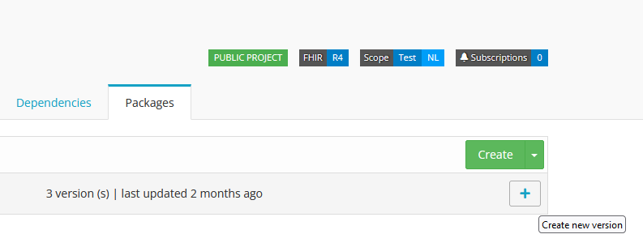
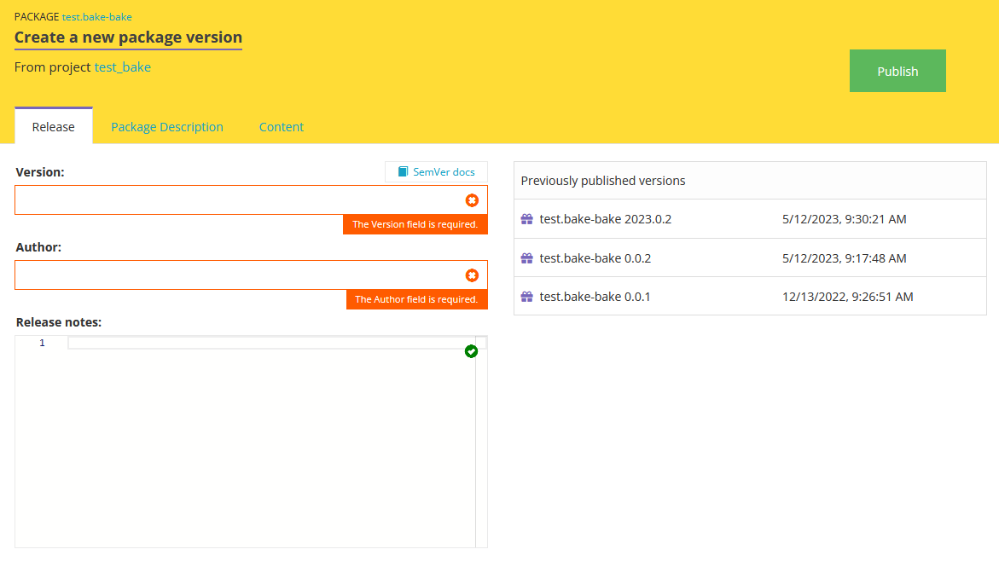

.. _FAQs:

Frequently Asked Questions
==========================

Is it possible to delete or rename a package?
^^^^^^^^^^^^^^^^^^^^^^^^^^^^^^^^^^^^^^^^^^^^^

It is not possible to delete or rename a package once it is created. You can only “unlist”  a package, this will make the package only visible to the creators of the package. 
Once a package is created the FHIR community should be able to depend on the continued existence of that package. Renaming or deleting would make that impossible. 

Can I customize the way resources are shown in Simplifier?
^^^^^^^^^^^^^^^^^^^^^^^^^^^^^^^^^^^^^^^^^^^^^^^^^^^^^^^^^^

This is possible by using `Metadata Expressions <./getting_started/simplifierResources.html#metadata-expressions>`_. Note that in order to use Metadata Expressions, you need at least a `Professional plan <https://simplifier.net/pricing>`_.

Can I sync from Simplifier back to GitHub using Simplifier GitHub Sync?
^^^^^^^^^^^^^^^^^^^^^^^^^^^^^^^^^^^^^^^^^^^^^^^^^^^^^^^^^^^^^^^^^^^^^^^

It is only possible to sync from GitHub to Simplifier and not the other way round. A workaround would be to sync your Simplifier work with your local folder using Forge or Firely Terminal and then commit that to Github. 
For more information, have a look at our `GitHub Sync documentation <./data_governance_and_quality_control/simplifierGithub.html>`_.

Does Simplifier support Custom Resources?
^^^^^^^^^^^^^^^^^^^^^^^^^^^^^^^^^^^^^^^^^

It is possible to upload custom resources to Simplifier, but in general the use of Custom Resources in Simplifier is not recommended, as you may experience issues when validating or rendering resources. 
It is also not possible to upload examples of custom resources.

What file formats can you upload to Simplifier?
^^^^^^^^^^^^^^^^^^^^^^^^^^^^^^^^^^^^^^^^^^^^^^^

You can upload .txt, .json, .xml, .yaml, .md, and image files to Simplifier.

Can I transfer projects to a different team?
^^^^^^^^^^^^^^^^^^^^^^^^^^^^^^^^^^^^^^^^^^^^

This is possible, please have a look at `our Team Management documentation <./administration/simplifierTeamManagement.html>`_.

How do I update package release notes after releasing a new package?
^^^^^^^^^^^^^^^^^^^^^^^^^^^^^^^^^^^^^^^^^^^^^^^^^^^^^^^^^^^^^^^^^^^^

You can add release notes when you create a new version of your existing package:

In the following screen, you can add release notes to this package, as well as the version number and details on the author:

