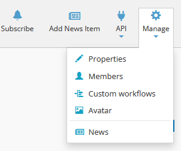
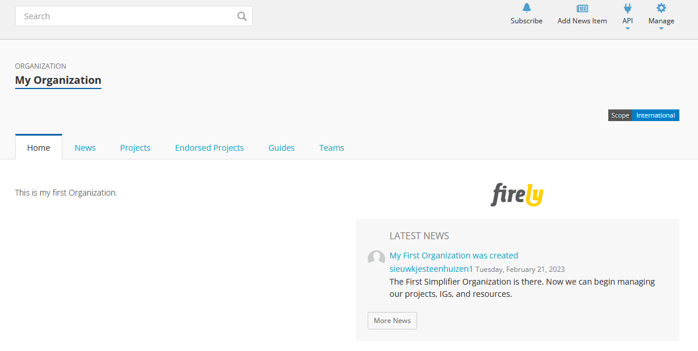
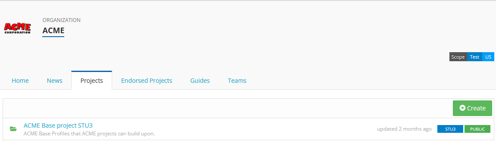
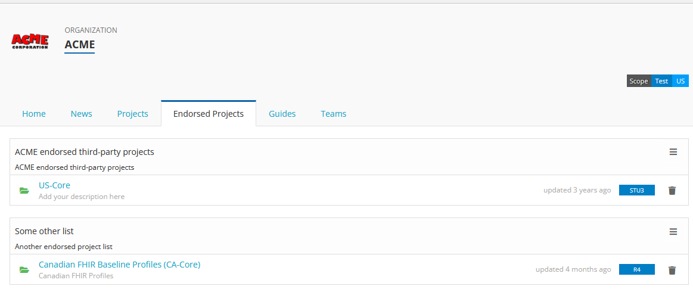
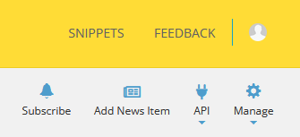

.. _Organization_page:

Organizations
^^^^^^^^^^^^^
.. important::

    `This feature is available from the Enterprise plan <https://simplifier.net/pricing>`_.

For our members with an Enterprise plan there is the functionality to create and manage an organizational account within Simplifier. An Organization account allows you to create and share projects, resources, and Implementation Guides via your organization with others within and outside your organization. You can add members and adjust rights to the project.  

Organization Management
-----------------------
Once you have made your account you can alter the properties of your organization, create custom workflows, manage members, and follow your organization’s newsfeed. These settings can be accessed via the ``Manage`` dropdown once you are on your organization’s page. The quickest way to visit your organization's page is to select it from the ``Organizations`` tab in your `personal portal <../administration/simplifierPersonalContent.html#personal-portal>`_

.. _Organization_Portal:

Organization Portal
-------------------
Your organization portal is a landing page for your organization that is visible to the outside world. On your portal you can add a logo, information about your organization and news feeds. Your organization portal also shows a list of your organization's projects.

Custom Workflow
-----------------
Custom workflows allow you to create statuses for your resources that fit your needs. You can use this to communicate to your organization team, in your own language, the progress of any given resource. This is in addition to the standard FHIR workflows of “Draft”, “Active”, and “Retired”. The FHIR workflows cover the following statues:

* Draft: This resource is still under development.
* Active: This resource is ready for normal use.
* Retired: This resource has been withdrawn or superseded and should no longer be used.

To create a Custom Workflow select ``Custom Workflow`` from the ``Settings`` dropdown on your organization’s page. The statuses that you make need to be mappable to the standard FHIR statuses. If you are creating your own workflows be sure to create a workflow for each associated level of the FHIR hierarchy. This is necessary because the FHIR statuses do not default into your custom list.

.. image:: ../images/CustomWorkflow.PNG
    :align: center

When you search for resources in Simplifier, the page with search results shows the Custom Workflow status next to the resource. You can click on the status to obtain an overview with the possible statuses and their explanations.

Organization Projects
----------------------
Your organization projects are a compilation of the projects that are owned by the organization. This section of your project maintenance is where you need to create and maintain organization projects. You can manage your organization projects by navigating to the  ``Projects`` tab on your organization's page. You can create new projects here by clicking on the ``Create`` button.

You also have the ability to create ``Project Lists`` in the ``Endorsed projects`` tab. This list is not necessarily a list of your own projects but rather of interesting projects that you would like to endorse within the Simplifier community. This list, once created, will show up on your organization’s page within Simplifier. To create this list, navigate to the ``Endorsed projects`` tab on your organization's page and click on ``Create new project list`` in the hamburger menu. In the form you are shown you can customize the title and description for your list. After customization click on ``Save``. To select the projects you want to add to your list, you click on the hamburger menu of your created list and click ``Add projects``. This will show you a page where you can search and select the projects you want to endorse. 

Newsfeed
--------
The ``News`` tab of your organization can be used to communicate to the outside world about new developments within the project. Your news items will also show on the main page of your organization. Once you have finalized resources or finished an implementation guide this is a great place to add an article announcing the changes. You can add news items by clicking the ``Add News Item`` icon in the top right of organization's page.

