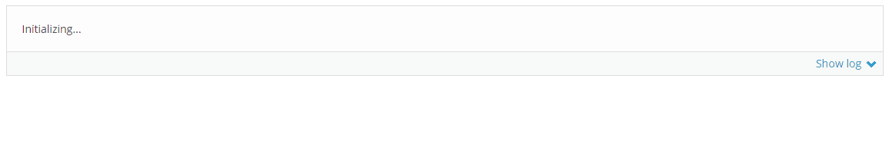
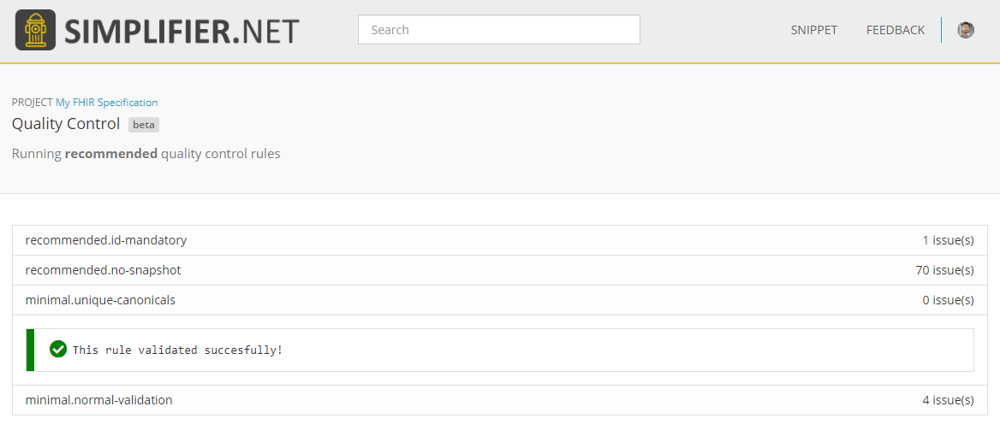
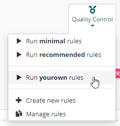

.. _QC:

Quality Control: Validating FHIR Projects
=========================================

.. important::

    `This feature is available from the Professional plan and up <https://simplifier.net/pricing>`_.

    `You can find our full syntax documentation on Simplifier <https://simplifier.net/docs/qualitycontrol/>`_.

This specification describes how to write (and read) rules for the
Simplifier Quality Control Engine.

    Example of Quality Control being executed on a project

**Simplifier.net** and :doc:`Firely Terminal<firely_terminal_docs:index>` come with a Quality Control
engine, helping you to improve the quality of your FHIR projects. The QC
engine performs a series of rule checks on selected files in your
Simplifier.net projects, on your local computer or at every change of your
source code repository.

There are **two default rulesets** available, which run FHIR validation on all FHIR
resources and a set of rules we at Firely recommend. Additionally, you can define
any number of **custom business rules** to enforce your own custom profiling standards.

    The results of running a ruleset in a Simplifier.net project

Structure
---------

A yaml rules file is named as follows: ``<name>.rules.yaml``. The
default ruleset is called ``default.rules.yaml``

Rulesets
^^^^^^^^

A yaml ruleset file consists of entries, start with a dash, followed by
a series of indented key-value pairs: Notice that the comments here are
not part of the entry, just an description how to read it.

.. code-block:: yaml

   # comment for first entry

   - first: value
     second: value
     third: value

   # comment for second entry

   - first: value
     second: value
     third: value

    Executing a ruleset in Simplifier.net

Default rulesets
^^^^^^^^^^^^^^^^

Simplifier will provide a few default rulesets, accessible to every project:
``minimal.rules.yaml`` and ``recommended.rules.yaml``.

Minimal ruleset
###############

The minimal series a very small set of rules that we know everyone
aggrees on. This minimal series include the bulk validation rule, 
validating all resources against the FHIR specification and your profiles.

Additionally it validates whether all your canonical URLs are unique, 
another minimal requirement for a FHIR specification.

.. warning::

  The rules below are a snapshot in time of the QC minimal rules and are subject to change.

.. code-block:: yaml

   # This is the minimal rule series

   - action: parse
     name: parse-fhir-resources 
     status: "Checking if all FHIR Resource files can be parsed"
     files:
       - /**/*.xml
       - /**/*.json
       - "!package.json"

   - name: resource-validation
     status: "Validating resources against the FHIR standard and their profiles"  
     action: validate
     category: Resource
     suppress: 
       - 6005
       - eld-16
  
   - action: unique
     name: unique-canonicals
     status: "Checking if all StructureDefinitions have a unique canonical"
     filter: StructureDefinition
     unique: url 

*Minimal ruleset snapshot 05-2021*

Recommended ruleset
###################

The recommended series is a more opiniated set of rules that we defined,
including what we believe a FHIR project should conform too. On top of the
minimal rules checks are added to ensure:

- All your resources have an `id`, which is not required but good practice.
  This will allow you to refer to any resource uniquely, even if it does not
  have a canonical URL.
- That the snapshot of the resource is not provided in your source models.
  While providing a snapshot is surely allowed, it makes your resources larger 
  than necessary and snapshots will be computed again by many tools anyway. 

.. warning::

  The rules below are a snapshot in time of the QC recommended rules and are subject to change.

.. code-block:: yaml

   - include: minimal
  
   - name: id-mandatory
     status: "Checking if all resources have an id"
     predicate: id.exists()
     error-message: "Resource {{filepath}} must have an id"

   - name: no-snapshot
     status: "Checking that structure definitions do not have a pre-generated snapshot"
     filter: StructureDefinition
     predicate: snapshot.element.count() = 0
     error-message: You should not generate a snapshot in your source. Allow the tools to generate the snapshot.

*Recommended ruleset snapshot 05-2021*

Custom rulesets
###############

You can add other rule files to your project, as long as their name
follows this pattern: ``<name>.rules.yaml`` and they are placed in the root
of your project. They will all be discovered by the system, and
exposed in the Quality Control menu of your project, to allow you to run
them.

`You can find our full syntax documentation on Simplifier. <https://simplifier.net/docs/qualitycontrol/>`_

Examples
--------

Here are some example rules, that you might consider when writing your
own rules:

Validating resources in a single folder
^^^^^^^^^^^^^^^^^^^^^^^^^^^^^^^^^^^^^^^

This example validates all resources in a single folder. It also
suppresses all parsing errors

.. code-block:: yaml

   - action: validate
     files: /examples/*.xml
     suppress: https://simplifier.net/qc/errors/evaluation|PARSING

Checking canonical base URLs
^^^^^^^^^^^^^^^^^^^^^^^^^^^^

This example validates whether the canonicals for your conformance
resources start with the right base URL:

.. code-block:: yaml

  - name: canonical-starts-with
    filter: url.exists() and ImplementationGuide.exists().not()
    # Excluding IGs for now, since they have a Simplifier.net canonical
    status: "Checking if canonical URL starts with correct base"
    predicate: url.startsWith('https://fhir.hl7.org.uk/')
    error-message: "Canonical URL doesn't start with correct base"

Checking if Publisher and Contact are filled (correctly)
^^^^^^^^^^^^^^^^^^^^^^^^^^^^^^^^^^^^^^^^^^^^^^^^^^^^^^^^

Quality Control is a powerfull way to check for consistent metadata
on all of your resources. In this case we are validating if the values
of ``publisher`` and ``contact`` are filled correctly and whether they
match each other. 

.. code-block:: yaml

  - name: publisher-filled
    filter: (StructureDefinition or ValueSet or CodeSystem or CapabilityStatement or SearchParameter or NamingSystem or ConceptMap).exists()
    # Excluding IGs for now, since they don't have a way to set metadata
    status: "Checking if all resources have publisher filled"
    predicate: publisher.exists() and (publisher in ('HL7 UK' | 'NHS Digital'))
    error-message: "Publisher not filled (correctly)"

  - name: contact-filled
    filter: (StructureDefinition or ValueSet or CodeSystem or CapabilityStatement or SearchParameter or NamingSystem or ConceptMap).exists()
    # Excluding IGs for now, since they don't have a way to set metadata
    status: "Checking if all resources have contact filled"
    predicate: contact.name.exists() and ('HL7 UK' in contact.name or 'NHS Digital' in contact.name)
    error-message: "Contact not filled (correctly)"

  - name: publisher-equals-contact
    filter: (StructureDefinition or ValueSet or CodeSystem or CapabilityStatement or SearchParameter or NamingSystem or ConceptMap).exists()
    # Excluding IGs for now, since they don't have a way to set metadata
    status: "Checking if publisher is one of the contacts"
    predicate: iif(publisher.exists() and contact.name.exists(), publisher in contact.name)
    error-message: "Resource has publisher not listed as one of the contacts"

Validate match between name and id
^^^^^^^^^^^^^^^^^^^^^^^^^^^^^^^^^^

When your profiling guidelines specify conventions, you can enforce them
easily with Quality Control. Like the below example, where a convention
was decided upon for the ``name`` and ``id`` property of a ValueSet.

.. code-block:: yaml

  - name: valueset-id-matches-name
    filter: ValueSet.exists()
    predicate: id = name.substring(0,6) + '-' + name.substring(6)
    status: "Checking if all ValueSet ids match the names, including a dash"
    error-message: "ValueSet id must match name with a dash"

Validating correct id naming for Extensions
^^^^^^^^^^^^^^^^^^^^^^^^^^^^^^^^^^^^^^^^^^^

With Quality Control you can easily filter to specific resources,
like the below case where we are checking the ``id`` value only for
Extensions.

.. code-block:: yaml

  - name: extension-starts-with
    filter: StructureDefinition.exists() and StructureDefinition.type = 'Extension'
    status: "Checking whether extension starts with Extension-UKCore"
    predicate: id.startsWith('Extension-UKCore')
    error-message: "Resource does not start with Extension-UKCore"
