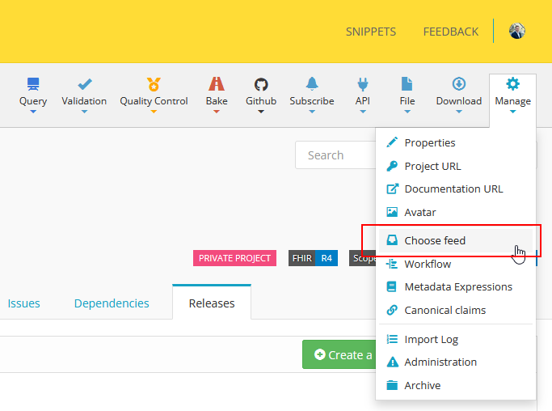
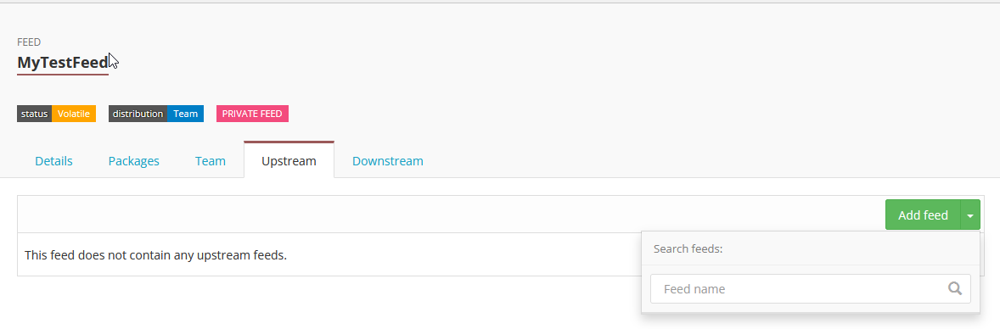

.. _package_feeds:

Package Feeds
=============
Simplifier has always offered the option to create private projects for the development and validation of your data models. Now, these projects benefit from access to private package feeds. This feature is ideal whether you are still developing your FHIR project or simply wish to distribute your packages to a select group of users, as it enables the private publication and distribution of your data models. With the introduction of package feeds, implementers can publish private packages directly from their Simplifier projects, create Implementation Guides for these packages, and develop projects using their own private packages as dependencies.

Setting up your feed
---------------------

In your private project, you can configure your Package Feed by navigating to **Manage > Choose Feed**. On the subsequent screen, you can create a new feed. After creating and applying the new feed, you may need to perform a **Restore** to update your project's dependencies.

When creating a package from you *private* project, if you have not configured your feed, you will see a warning label asking if you want to publish you package publicly or if you want to create a private package feed.

.. image:: ../images/ConfigureFeed.png

After going through the steps to create your private package feed:

.. image:: ../images/CreateFeed.png

You will see the feed on your project page.

.. image:: ../images/PackageFeed.png

Simplifier will throw a warning if you need to do a restore of your dependencies after creating or changing your feed. 

.. image:: ../images/PackageClosureError.png

Managing multiple Feeds
-----------------------
If different teams within your organization are working on separate private implementations and you want to consolidate these efforts, you can add their package feeds to your upstream dependencies. Please note that this functionality is only available for feeds within the same Organization.

Current limitations and restrictions
------------------------------------

It is not possible to create a private package from a public Simplifier project. To create a private release, you have two options:

1. **Convert your project to private**: Change the project settings from public to private and then create your release.

2. **Use semantic versioning (semver) labels**: If you do not require a private release but wish to indicate that the release is not stable, we recommend using semver labels such as ``-alpha``. After release, consider unlisting the packages to reduce visibility.

Private package publication and installation with Firely Terminal is temporarily unavailable, but will be brought back soon!