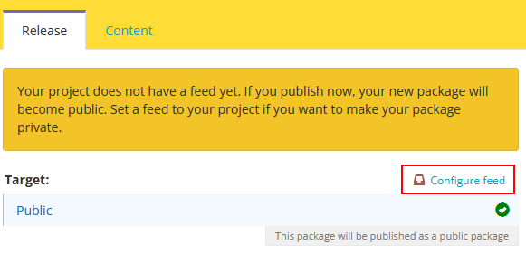
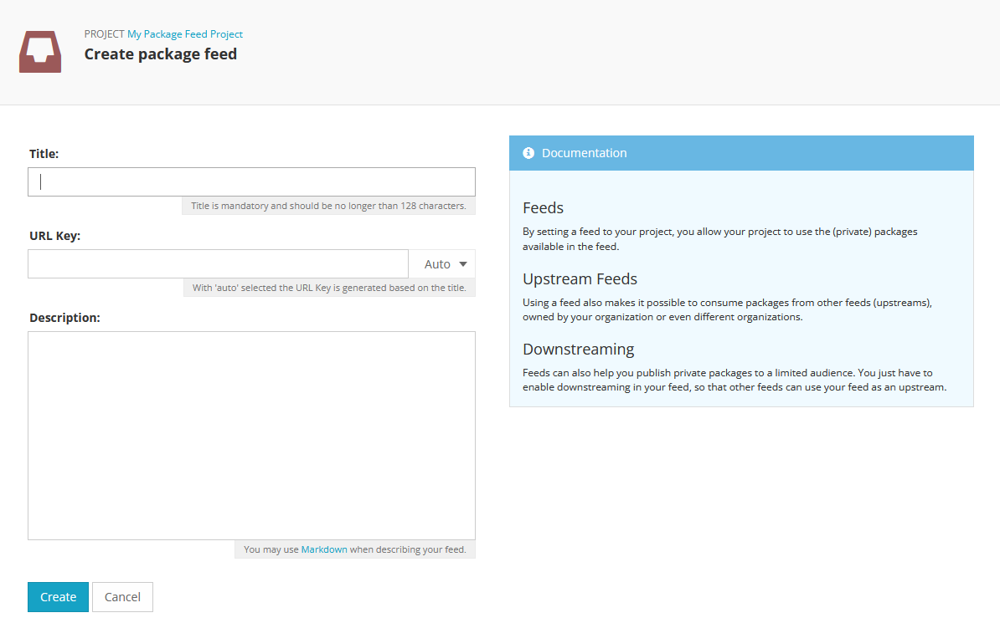
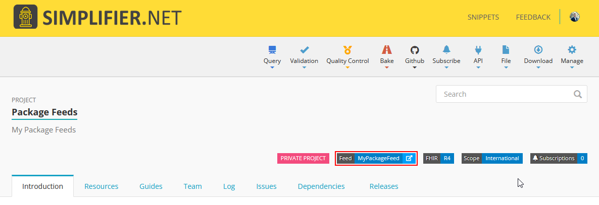
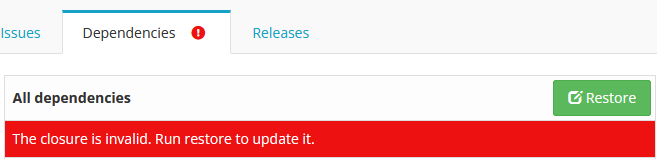

Package Feeds
=============
Simplifier has always offered the option to create private projects for the development and validation of your data models. Now, these projects benefit from access to private package feeds. This feature is ideal whether you are still developing your FHIR project or simply wish to distribute your packages to a select group of users, as it enables the private publication and distribution of your data models. With the introduction of package feeds, implementers can publish private packages directly from their Simplifier projects, create Implementation Guides for these packages, and develop projects using their own private packages as dependencies.

Setting up your feed
---------------------

When creating a package from you *private* project you will see a warning label asking if you want to publish you package publicly or if you want to create a private package feed.

After going through the steps to create your private package feed:

You will see the feed on your project page.

Simplifier will throw a warning if you need to do a restore of your dependencies after creating or changing your feed. 

Current limitations and restrictions
--------------------
It is not possible to create a private package from a public Simplifier project. You can either make your project private to create a private release. Or, if your release does not need to be private but you just want to signal to your users it is not a stable release, we recommend using semver labels like ``-alpha`` and potentially unlisting packages afterwards.

Private package publication and installation with Firely Terminal is temporarily unavailable, but will be brought back soon!