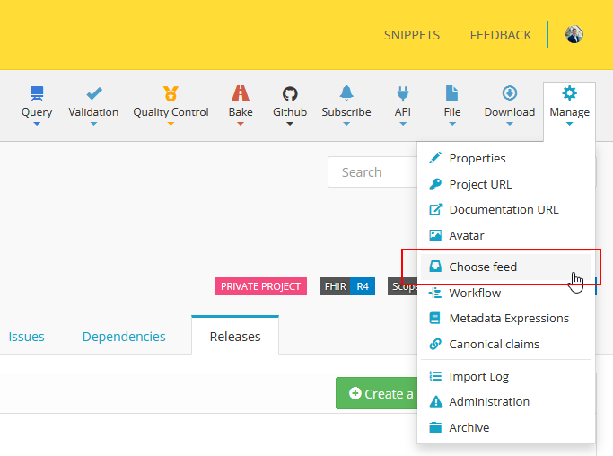
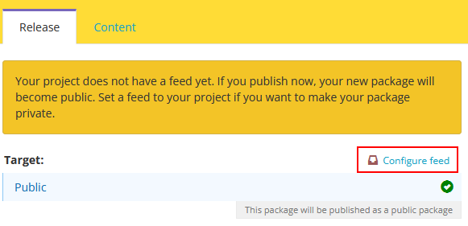
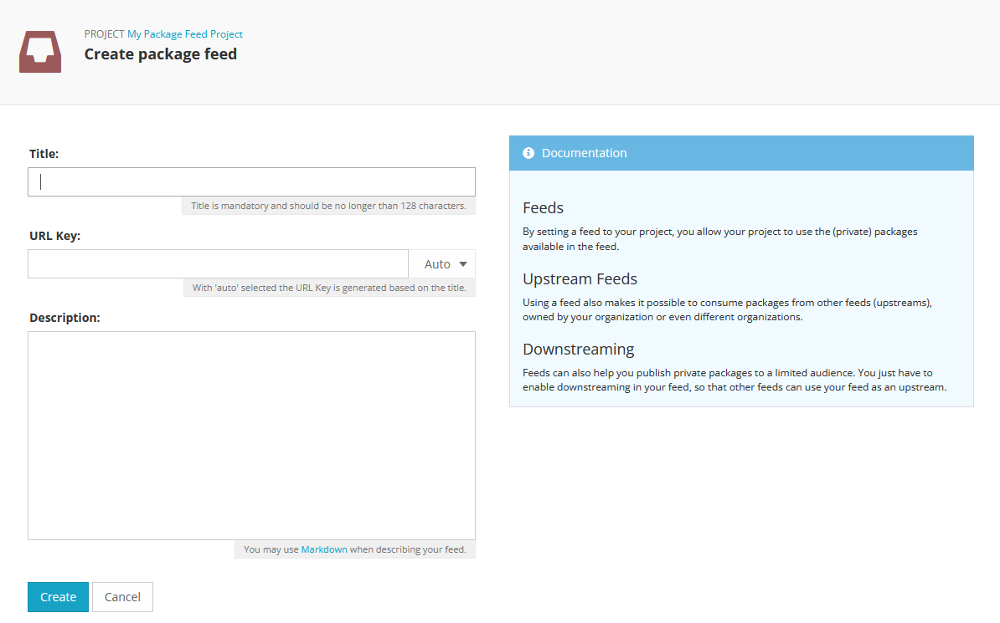
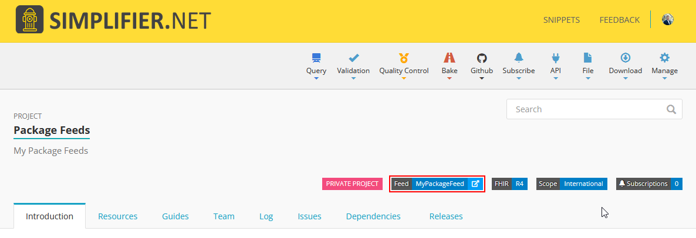
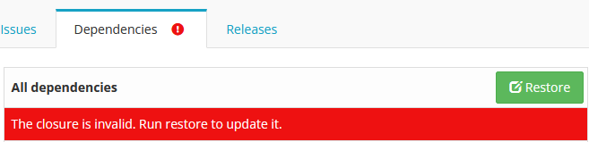
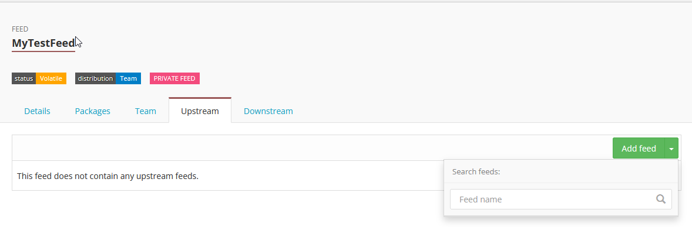
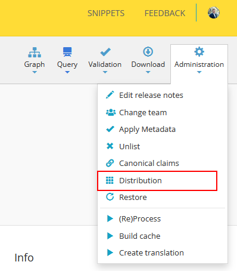

.. _package_feeds:

Package Feeds
=============
Package feeds allow you to manage and distribute private FHIR packages with controlled access.

Getting Started with Package Feeds
----------------------------------

What is a package feed, in plain English?
~~~~~~~~~~~~~~~~~~~~~~~~~~~~~~~~~~~~~~~~~

You already know what a FHIR package is: a collection of FHIR resources (profiles, extensions, value sets, and so on) that gets published so other projects can use it as a dependency.

By default, when you publish a package on Simplifier, it goes into the **main public feed** - a shared space where anyone can find and use it.

A **private package feed** is your own separate space. Packages you publish there are only visible to people you give access to.

In short, a feed is **a named container for packages, with its own access controls**.

.. note::

   Private packages can only be found and accessed through a feed. They no longer appear under the Packages tab on the portal, organization, or team pages.

Why would I need one?
~~~~~~~~~~~~~~~~~~~~~

You need a private feed if any of the following apply:

* You are developing a FHIR package that is not ready for public release.
* You want to share packages with colleagues or partners, but not publicly.
* Your project depends on another private package that your team manages.
* You are building an Implementation Guide around profiles that should stay internal.

If all your packages are public and you have no private dependencies, the main Simplifier public feed is usually enough.

The key things to know before you start
~~~~~~~~~~~~~~~~~~~~~~~~~~~~~~~~~~~~~~~

* **A feed is linked to a team.** Everyone in the managing team gets access to the feed and all packages in it.
* **Every private package lives in exactly one feed.** You choose the feed when publishing the package.
* **Your project needs a feed assigned before it can use private packages.**
* **After changing dependencies, run Restore.** When the Restore button turns green, run it.

Step-by-step: setting up a feed for the first time
~~~~~~~~~~~~~~~~~~~~~~~~~~~~~~~~~~~~~~~~~~~~~~~~~~

Step 1: Make sure your project is private
^^^^^^^^^^^^^^^^^^^^^^^^^^^^^^^^^^^^^^^^^^

Private feeds can only be used with private projects. If your project is public, set it to private first.

Step 2: Assign a feed to your project
^^^^^^^^^^^^^^^^^^^^^^^^^^^^^^^^^^^^^^

In your project, go to **Manage > Choose Feed**.

You can select an existing feed or create a new one.

When creating the feed, provide:

* **Feed key**: A short URL-safe identifier, such as ``my-org-internal``. The feed key is globally unique across Simplifier. For permanent feeds, it cannot be changed later.
* **Title**: A readable name, such as "My Organization Internal Feed".
* **Managing team**: The team whose members get access to this feed.

After creation:

The feed is assigned and visible on your project page.

Step 3: Run a Restore
^^^^^^^^^^^^^^^^^^^^^

Go to the **Dependencies** tab and run **Restore**. This rebuilds the dependency closure using the assigned feed.

When the Restore button is green, a restore is required.

Step 4: Publish a package to your feed
^^^^^^^^^^^^^^^^^^^^^^^^^^^^^^^^^^^^^^^

Go to **Releases** and create a new release. Confirm the package is being published to the intended feed.

Step 5: Use the package in another project
^^^^^^^^^^^^^^^^^^^^^^^^^^^^^^^^^^^^^^^^^^^

Assign the same feed to the other project, add the package from the **Dependencies** tab, then run **Restore**.

Common questions
~~~~~~~~~~~~~~~~

**I cannot find my feed to assign it to a new project. Why?**

Feeds can only be assigned to projects managed by the same team.

**I added a dependency but my project cannot see it. What is wrong?**

Usually, you need to run **Restore**.

**Can I use packages from two different feeds in one project?**

Not directly. Use upstream feeds to connect feeds. The upstream feed must be permanent, and both feeds must be managed by the same team.

**Can I make a package public after publishing it to a private feed?**

Not currently.

**My project shows a dependency warning after changing feed. Is that bad?**

It usually means a restore is needed.

Technical reference
-------------------

Feed status: Volatile and Permanent
~~~~~~~~~~~~~~~~~~~~~~~~~~~~~~~~~~~

Every feed has a status that determines what you can do with it.

.. list-table::
   :header-rows: 1

   * - Status
     - What it means
   * - **Volatile**
     - The feed is still being set up. Its contents can change and it can be deleted. Do not rely on a volatile feed for stable dependencies.
   * - **Permanent**
     - The feed is locked. It cannot be deleted and its contents cannot change. Only permanent feeds can be used as upstream feeds.

Managing a feed
~~~~~~~~~~~~~~~

Feed admins can manage a feed from either the **Feeds** tab on the organization or portal page, or directly from the feed page.

Feed admins can update the title, feed key, and distribution settings after creation. For permanent feeds, the feed key cannot be changed.

A feed can only be deleted when all three conditions are met:

* The feed is not marked as permanent.
* The feed is not currently assigned to any project.
* The feed contains no published packages.

If a feed contains packages that have been soft-deleted, you are warned before deletion proceeds. Those packages become permanently unavailable.

Creating feeds from organization scope (Enterprise)
~~~~~~~~~~~~~~~~~~~~~~~~~~~~~~~~~~~~~~~~~~~~~~~~~~~

Enterprise users can create feeds in advance from the organization **Feeds** tab, before assigning feeds to projects. When creating a feed this way, you can select an existing organization team to manage it, or create a new one.

Upstream feeds
~~~~~~~~~~~~~~

An **upstream feed** lets your feed draw on packages published in another feed, without publishing copies of those packages yourself.

When a project performs a **Restore**, packages from configured upstream feeds are pulled into your feed and become available as dependencies.

Requirements:

* Only **permanent** feeds can be used as an upstream feed.
* The upstream feed must be managed by the **same team** as the feed you are adding it to.
* You must have access to both feeds.

Set upstream feeds from the **Upstreams** tab on the feed page.

Package sources and restore behavior
~~~~~~~~~~~~~~~~~~~~~~~~~~~~~~~~~~~~

Each package in a feed is tagged by source:

.. list-table::
   :header-rows: 1

   * - Source
     - What it means
   * - **Project**
     - Published directly to this feed from a Simplifier project.
   * - **API**
     - Published directly to this feed via the Simplifier packages API.
   * - **Upstream**
     - Pulled into this feed from an upstream feed during a Restore.

Any package in a feed can be soft-deleted. Soft-deleted packages are hidden from users and dependency resolution.

Restore behavior differs by source:

* **Upstream-sourced packages** can be restored automatically when needed by restore.
* **Directly published packages** are not restored automatically; a feed admin must restore them manually.

Feed assignment rules for project types
~~~~~~~~~~~~~~~~~~~~~~~~~~~~~~~~~~~~~~~

Which feeds you can assign depends on project type:

.. list-table::
   :header-rows: 1

   * - Project type
     - Available feeds
   * - **Private project**
     - Main Simplifier public feed, or any feed managed by the same team as the project.
   * - **Public project**
     - Main Simplifier public feed only.

.. important::

   Public projects cannot use private feeds. For the same reason, a private project with a private feed assigned cannot be converted to a public project.

Changing assigned feed
~~~~~~~~~~~~~~~~~~~~~~

Changing a project feed is possible from **Dependencies**, but each feed change deletes the project dependency closure and requires a full restore.

Dependency closure and Restore
~~~~~~~~~~~~~~~~~~~~~~~~~~~~~~

The **closure** is the full resolved dependency set for a project, including direct and indirect dependencies.

The closure is used for:

* Resource rendering (snapshot generation).
* Resource validation.
* Quality control checks.
* Baking your project into a package.

Restore is a manual step.

Feeds and packages
~~~~~~~~~~~~~~~~~~

Private package URL format:

::

   /feeds/{feed-key}/packages/{package-name}/{version}

Public package URL format (backwards compatible):

::

   /packages/{package-name}/{version}

Package visibility is feed-specific. Two versions of the same package can have different visibility depending on feed.

.. note::

   Dependency history, latest-version calculation, and cached snapshots of a package are feed-specific.

Package admins can view distribution details under **Administration > Distribution**.

Feeds and Implementation Guides
~~~~~~~~~~~~~~~~~~~~~~~~~~~~~~~

Private packages can be used as Implementation Guide scope when the package is in the feed assigned to the project where the guide lives.

In the guide editor, go to **Settings > Scope**.

.. important::

   If you lose access to the feed that contains your guide scope package, you also lose the ability to render that guide.

Feeds in Validator, Playground, and Documentation Resolve
~~~~~~~~~~~~~~~~~~~~~~~~~~~~~~~~~~~~~~~~~~~~~~~~~~~~~~~~~

When selecting a scope in these pages, you can choose packages from feeds you have access to. To search in a specific feed, use:

::

   {feed-name}/{package-name}

If no feed is specified, only public packages are shown.

Finding feeds and packages
~~~~~~~~~~~~~~~~~~~~~~~~~~

Feeds are listed on:

* The portal home page.
* Your organization page.
* Your team page.

Private packages are no longer visible under the **Packages** tab on those pages.

License and access
~~~~~~~~~~~~~~~~~~

The number of feeds you can create depends on your Simplifier license.

Access to feed packages is inherited from the managing team.

Current limitations
~~~~~~~~~~~~~~~~~~~

The following features are not yet supported:

* Making a private package public after it has already been published to a private feed.
* Setting upstream feeds across different teams.

