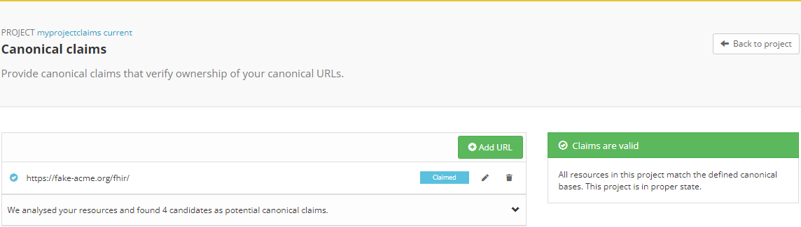
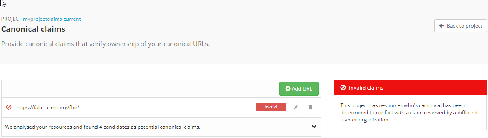
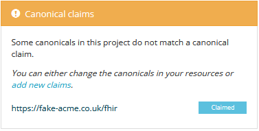
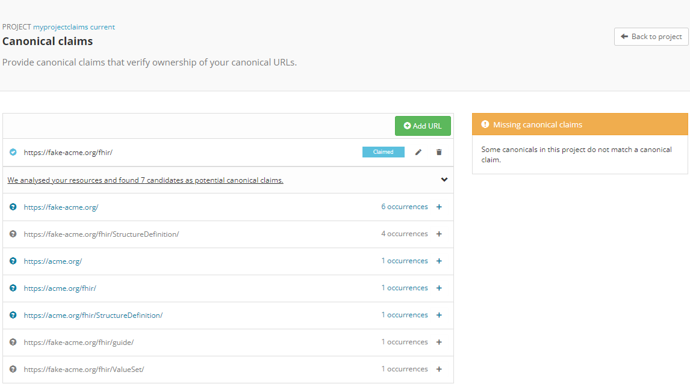
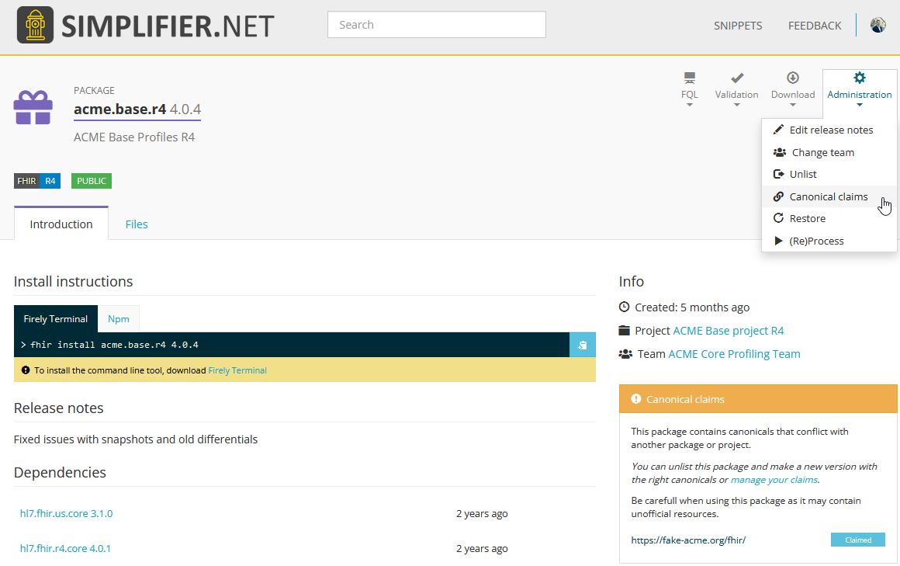
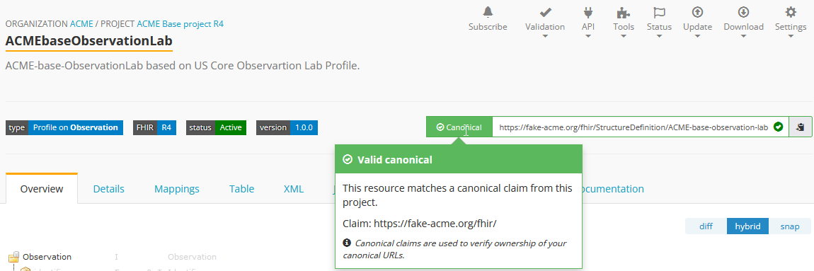
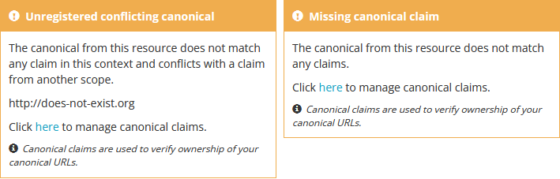
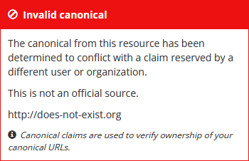

.. _Canonical_Claims:

Canonical claims
================
Project owners can customize their base canonical URLs to brand their projects. Canonical claims are used and recognized as a certificate, or proof of origin, for your resources: a resource's canonical URL is only valid if it matches a canonical base claimed by the project. You can claim canonicals on a project, package, and resource level.

**On project level**: claim a canonical under the ``Canonical claims`` option in the project Manage dropdown. The Canonical claims page shows the claimed canonicals and the status of each claim.

Claiming a canonical declares ownership of it. If another user disputes your claim and has the legitimate claim, a site admin can set your claim as invalid. Reach out to us if you want to open a dispute about invalid canonical claims.

If your project contains resources with a canonical base that is not claimed, Simplifier shows a warning on the Project page, and the ``Canonical claims`` option shows which claims you are missing. This could also indicate that some resources have an unintended canonical (base) URL. You can create custom bulk validation rules to validate your entire project using our :ref:`Quality Control <QC>` feature.

**In packages**: after a package is created, its canonicals can be managed under the package Administration. The claim statuses are the same as on the project level.

**On a resource level**: every resource shows a status next to its canonical URL indicating whether the base was claimed by the project. The status can be valid, a warning that the base was not claimed, or an error stating the canonical is invalid (for example, when it is already claimed by another organization or user).

**Best practice**: when adding canonical claims, we recommend using the longest common denominator. For resources generated from the IG editor, the default canonical base is ``https://simplifier.net/guide``; everyone is allowed to claim this canonical in their projects and packages.
