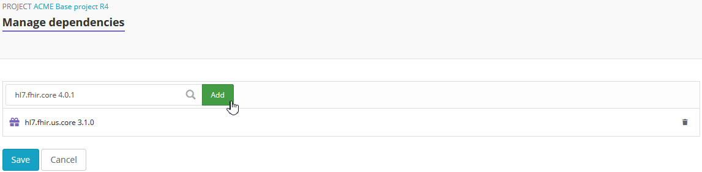
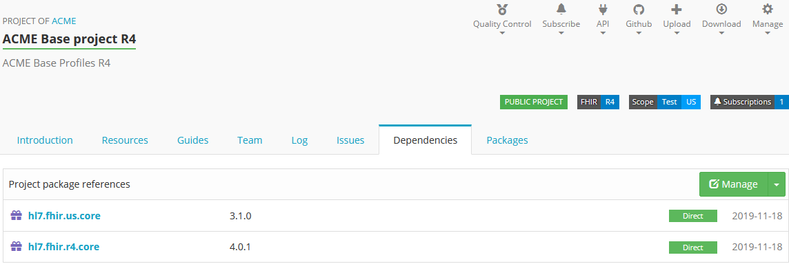
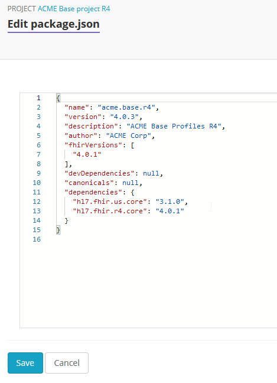

Managing dependencies
=====================

The packages your project depends on are listed in its ``package.json``. Together with the project's own resources, their resolved versions form the project's scope: see :ref:`canonical_resolution` for how Simplifier resolves references in it.

.. _view_dependencies:

View dependencies
-----------------
Visit the ``Dependencies`` tab of any Simplifier project to see its dependencies. The tab has two tables:

* ``Direct dependencies``: the packages you asked for in ``package.json``.
* ``All dependencies``: what they resolved to, including the indirect dependencies (the dependencies of your dependencies). Direct dependencies are shown in bold.

``All dependencies`` can list the same package more than once, in different versions, when your dependencies ask for different versions of it. All of them are in scope; which one a reference uses is explained in :ref:`canonical_resolution`.

Each dependency shows its FHIR version. Tags point out packages that need attention:

* ``Mismatch``: the FHIR version of this package does not match the FHIR version of your project.
* ``Unlisted``: the author has unlisted this version. Consider upgrading or downgrading.
* ``Pre-Release``: a pre-release package, which should not be used in an official package release.
* ``Missing``: the dependency could not be found. Run a restore.
* ``Uppercase`` and ``InvalidChars``: the package name contains uppercase letters or invalid characters.
* ``Update``: a newer release of this package is available. Hover over the tag to see which.

The ``Dependencies`` tab of a package lists its dependencies with their version, FHIR version and release date, and the same ``Unlisted`` and ``Missing`` tags.

Click on the name of one of the listed packages to see the details of this package.

Add dependencies
----------------
Visit the ``Dependencies`` tab to add dependencies to your project. There are two ways to do so. One way is to browse Simplifier for existing packages and add them to your project. The other way is to directly edit the JSON code.

Click ``Manage`` to search for existing dependencies. Type a search string in the search box and select a package and its version from the search results. Click ``Add`` to add the package to your project. When you are finished adding packages click ``Save`` to save the changes to your project.

Click ``Edit`` to directly edit the JSON code and add the packages and their version to ``dependencies``.

.. _package_aliases:

Depend on two versions of the same package
------------------------------------------
``package.json`` has one entry per package name. To depend directly on a second version of a package, give it an npm-style alias: write the alias, ``@npm:`` and the real package name as the key, and the version as the value.

.. code-block:: json

   {
     "dependencies": {
       "hl7.fhir.us.core": "7.0.0",
       "uscore610@npm:hl7.fhir.us.core": "6.1.0"
     }
   }

After a restore both versions are in scope, and an aliased dependency stays in scope even when another version of the same package is present. Restore, bake with FSH, generating the ImplementationGuide resource and the IG Publisher all read the alias.

The alias is only a local name. References still resolve by canonical URL, as explained in :ref:`canonical_resolution`, so pin a reference when it has to use one of the two versions.

Remove dependencies
-------------------
To remove dependencies from your project, you could either select ``Manage`` and click on the recycle bin icon next to the package you want to remove or select ``Edit package.json`` to directly edit the JSON code.

Restore dependencies
--------------------
A restore resolves the dependencies in your ``package.json`` again and updates ``All dependencies``. Click ``Restore`` on the ``Dependencies`` tab when:

* you edited ``package.json`` directly, or imported an updated one from GitHub;
* the tab says ``Your resolved dependencies are outdated. Run restore to update them.`` or ``Your resolved dependencies are invalid. Run restore to update them.``;
* the tab says ``Some dependencies could not be found. Run restore to try resolving them again.``

The ``Restore`` button turns green when a restore is needed.
