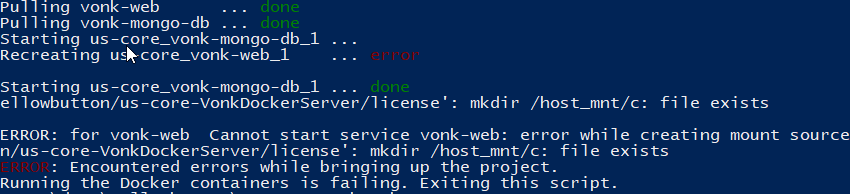
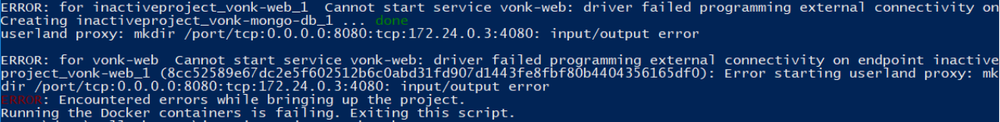

.. _simplifier_firely_server:

Use Firely Server with your Simplifier artifacts
===================================================

If you have defined some profiles, valuesets and examples in your Simplifier project, you may want to setup a FHIR Server for you or others to test against.
We have tried to make that extremely simple for you, using Firely Server. Here is how:

.. raw:: html

    

       <iframe width="560" height="315" src="https://www.youtube.com/embed/FcIgCRO82mI" title="YouTube video player" frameborder="0" allow="accelerometer; autoplay; clipboard-write; encrypted-media; gyroscope; picture-in-picture" allowfullscreen></iframe>
    

Currently we only enabled this for Windows 10, using PowerShell. Later we will add support for Linux and/or MacOS.

#. Install `Docker for Windows <https://www.docker.com/get-docker>`_
#. Start it.
#. Open its settings (right click on the docker icon in the system tray and click 'Settings')
#. Under shared drives, share your local drive.
   
   .. image:: ../images/YellowButton_ShareDrive.png 
      :scale: 75%

#. Now in Simplifier, go to the project page of your project, drop down the Download button and click 'demo FHIR Server'

   .. image:: ../images/YellowButton_DownloadFHIRServer.png 

#. This takes you to the 'Demo Project FHIR Server' page.
#. Click the 'Download' button

   .. image:: ../images/YellowButton_DownloadZip.png
      :scale: 75%

#. Unzip the downloaded file. For this explanation we choose to unzip to ``c:\programs\demo-VonkDockerServer``
#. Open a PowerShell window
#. Since we have not (yet) signed the Powershell script that will start the server, you need to temporarily allow execution of downloaded scripts::

      Set-ExecutionPolicy -ExecutionPolicy Unrestricted -Scope Process

#. Navigate to the directory where you unzipped the download.
#. Then run the script .\\start-vonk-server.ps1

   .. image:: ../images/YellowButton_RunStart.png
      :scale: 75%
      
#. The script will:

   * pull the neccessary images from the Docker hub (vonk-web and vonk-mongo-db)
   * start the containers
   * import conformance resources from the specification AND your Simplifier project
   * import the examples from your Simplifier project

   This will take a couple of minutes. Subsequent startups will be a lot faster though.

   .. attention:: Docker and PowerShell are not perfect friends, and Docker may show some 'NativeCommandError' messages. You can ignore those.

#. You can use the .\stop-firely-server.ps1 script to stop Firely Server again.

Common errors and mistakes
--------------------------

Error messages
^^^^^^^^^^^^^^

1. Docker is not running

``Error during connect: Get http://%2F%2F.%2Fpipe%2Fdocker_engine/v1.39/containers/json: open //./pipe/docker_engine: The system cannot find the file specified. 
In the default daemon configuration on Windows, the docker client must be run elevated to connect. This error may also indicate that the docker daemon is not running.
Docker is not running, now exiting the script. See https://docs.docker.com/docker-for-windows/install/ for more information.``

        
Solution: The problem is exactly as stated -- your Docker for Windows is probably not running. Start it from the Windows Start menu and try again.

2. Mount failed

``ERROR: for vonk-web  Cannot start service vonk-web: error while creating mount source path '/host_mnt/c/data/yellowbutton/us-core-VonkDockerServer/license': mkdir /host_mnt/c: file exists``

      
Solution: This may happen at subsequent starts of the Firely Server container. It appears to be an error in Docker for Windows. But it may be fixed by resetting the credentials for Drive Sharing in Docker for Windows (even if you did not change your password). 

3. Network failed

``ERROR: for vonk-web  Cannot start service vonk-web: driver failed programming external connectivity on endpoint ...``

      
Solution: This is an issue reported as `Issue 1967 on Docker for Windows`_. It can be solved by restarting Docker on Windows. 

Configuration checks
^^^^^^^^^^^^^^^^^^^^

1. Is Docker for Windows configured to run *Linux* containers and not Windows containers? Check the `Docker switching Container type`_ documentation on this if needed.
2. Did you enable Shared Drives on Docker for Windows? Yellow Button needs this to provide the license file to the Docker container.
3. Did you change your Windows password after sharing your drive in Docker for Windows? If so, you need to reset your credentials in Docker for Windows.
4. Does Docker for Windows have enough resources to let Firely Server run its initialization within the designated time? You can give it more resources in the `Docker Advanced Settings`_.

Still no luck? Please contact us on server@fire.ly. Please include:

- the output of the Powershell script ./start-firely-server.ps1
- version info of Windows
- version info of Docker for Windows
- any other information you think is relevant.

Using the server
----------------

When your Firely Server is running, you can check whether your profiles are indeed present in the server by requesting them from the Administration endpoint. In this example we search for the US-Core profiles::

    GET http://127.0.0.1:8080/administration/StructureDefinition?url:below=http://hl7.org/fhir/us/core

Please note that any Conformance resources that influence the behaviour of Firely Server -- such as the Validation -- must be managed on the Administration API and not the regular FHIR endpoint. See :ref:`administration_api` for more background.

If the project you created the server off of contains any *example* resources, they will be available at the normal FHIR endpoint::

    GET http://127.0.0.1:8080/<more specific search if you want>

Your project in progress
------------------------

You created the Firely Server off of a Simplifier project. That project may evolve. Either because it is your own and you improve your profiles, or because the maintainer of the project applies changes. Firely Server is connected to the Simplifier project. This means that you can update the conformance resource in Firely Server from the contents of the project by:

- invoking importResources::

    POST http://127.0.0.1:8080/administration/importResources

- or restarting Firely Server::

    > ./stop-firely-server.ps1
    > ./start-firely-server.ps1

Further steps
-------------

Our Out of the box FHIR Server is an easy way to get started with Firely Server. But there are many other :ref:`deployment options <firely_server_docs:deployment>` for the server. Besides that you can add your own plugins with :ref:`Firely Server Plugins <firely_server_docs:vonk_plugins>`, or build a :ref:`Firely Server Facade <firely_server_docs:vonk_facade>` with Firely Server. 

.. _Simplifier: https://simplifier.net

.. _Docker switching Container type: https://docs.docker.com/docker-for-windows/#switch-between-windows-and-linux-containers

.. _Docker Advanced Settings: https://docs.docker.com/docker-for-windows/#advanced

.. _Documentation on ExecutionPolicy: http://go.microsoft.com/fwlink/?LinkID=135170

.. _Issue 1967 on Docker for Windows: https://github.com/docker/for-win/issues/1967

