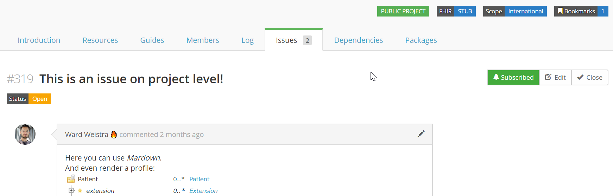

.. _issue_tracker:

Issue tracker
=============

.. important::

    Issue tracking is available from the Team plan and up; collecting public feedback comes with the Enterprise plan. `See the pricing page for details. <https://simplifier.net/pricing>`_

Would you like to capture feedback about your resources from users? The Issue tracker option is a great way to do this. If you go to the ``Settings`` dropdown menu and then select ``Properties``. You will see the option to Enable Issues at the bottom of your screen. By selecting the On option, you enable the issue tracking feature of your project.

      

There are two additional options that display once you have turned Issue tracking on. You have the option to limit Issue visibility to project members only or make them publicly visible. The issues that are reported by the community can also be limited to be visible to your project members only or visible to the public.

These issues can either be reported at resource level or at project level. At the project level you will see issues that are project specific and issues from all resources in that project on the ``Issues`` tab.

You will automatically be subscribed to issues you have reported or commented on, but you can also subscribe or unsubscribe to updates on them by clicking their bell icon. If you want to be informed on new issues reported on a project, click the ``Subscribe`` button on the project level and ``Subscribe to new issues`` there.
