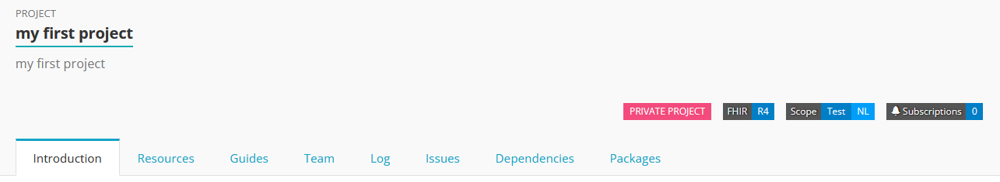
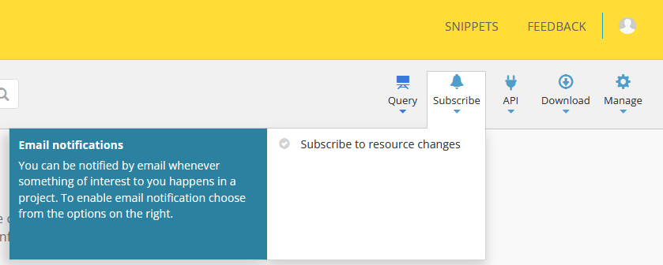
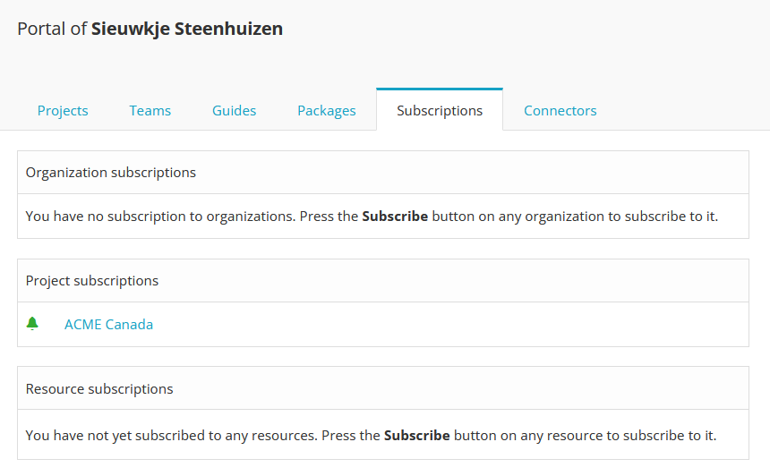
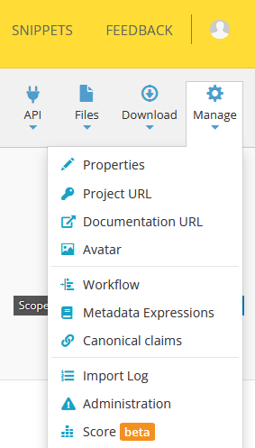

.. _Project_Page:

Projects
^^^^^^^^

.. important::

    `Private and multiple projects are available from the Professional plan and up <https://simplifier.net/pricing>`_.

Simplifier organizes all content (e.g. resources and Implementation Guides) in projects. A project can be used to share all your FHIR resources and documentation with the community as well as to collaborate with other project members.

Open your project
"""""""""""""""""
For an overview of your projects, go to your `personal portal <../administration/simplifierPersonalContent.html>`_ by clicking on your avatar in the top right corner.

.. image:: ../images/UserMenu.PNG 
   :scale: 75%
      
The Projects tabs lists all projects you are involved in, either because you created the project yourself (making you the owner of the project) or because you are invited to the project as a project member.

.. image:: ../images/PersonalPortal.PNG
   :scale: 75%
      

Click on the title of a project to open its project page.

.. _project-page:

Project page
""""""""""""
Each project contains a couple of tabs depending on the settings of the project and your role in the project. The tabs described below are visible for each user in each Simplifier project.

      
   
Introduction
------------
This section serves as an overview of your project. This is a good area to share information about your project with people that may be team members or viewing your project for the first time. 

On the ``Introduction`` page of a project you can find:

- A summary text as added by the project owners
- A summary table describing the contents of the project:

	+ Number of resources per resource type
	+ Number of examples per resource

- The canonical base URLs supported in the project
- The workflow statuses supported in the project

When clicking on a resource type in the summary table (e.g. profiles) you navigate to the ``Resources`` tab, where the resources will be filtered on the selected resource type.

Resources
---------
On the ``Resources`` tab you can find all the Conformance and Example Resources for the project.
This tab also offers a search and filter option. You can filter your results to include or exclude certain Resource categories, Core base types, Example Resources type, FHIR status, and Workflow status. 
 
Guides
------
The ``Guides`` tab shows all Implementation Guides for this project built in Simplifier. Click on the Guide or hit the ``Browse`` button to go to the Implementation Guide. Use the `IG-editor <../features/simplifierIGeditor.html#implementation-guide-editor>`_ to create and edit Implementation Guides.
 
Team
----
On the ``Team`` tab you can find all project members and their role. This tab also offers a search option, allowing you to search for other members using their full name or username. Depending on your role in the project you can `add project members <simplifierProjects.html#id1>`_ here.

Log
---
On the ``Log`` tab you can see all the changes that have been made to this project in the past. This is a good way to stay in touch with whats happening within your favorite projects. 

Issues
------
On the ``Issues`` tab you can leave your issues regarding the project. Note that this tab is not visible in all projects. The `Issue Tracker <simplifierProjects.html#id2>`_ is a paid functionality that allows project members to collect feedback from other project members or (depending on the project settings) other Simplifier users.

Dependencies
------------
Currently references to other profiles are resolved by latest version. By adding package dependencies, references will be resolved in those packages. This gives you much better versioning control over the resources you include.

Currently this only works for downloaded packages. In the next release it will work for snapshot generation, validation and link generation.

Packages
----------
The ``Packages`` tab shows all released versions of a project. Project members may use this beta functionality to release project versions containing (a selection of) resources as a package. 
`Packages <../features/simplifierPackages.html#package-management>`_  are now public BETA. We encourage you to try them out. But you should not use them for production environments yet. 

Subscriptions
"""""""""""""
To stay informed in real time click the ``Subscribe`` button in the top right. You do not have to be a member of a project to stay up to date on the latest developments. 

      
You can find your current subscriptions in your user portal under the ``Subscriptions`` tab:

      
Create a project
""""""""""""""""
In the Projects tabs on your Portal page you can find the button labeled ``Create``. 

.. image:: ../images/PersonalPortal.PNG
   :scale: 75%
      

Clicking this button will allow you to create a new project by entering a Display Name, Description, and Scope. Once the project has been created you can then customize project information, add resources, add members, and follow changes that are occurring in that project.

.. image:: ../images/CreateProject.PNG 
   :scale: 75%
      
Project Management
""""""""""""""""""
You can always change your project settings by clicking on the ``Manage`` button in the right upper corner. There are a couple of options in the Manage menu, which will be explained below.

      
Properties
----------
Here you can edit the following properties: 

- The title and subtitle of your project
- The FHIR version (DSTU2 or STU3)
- The scope of your project (core, international, national, institute, regional or test). As choosing the right scope will make it easier for others to find your project, please use test for all test projects and test projects only.
- Issue tracking by project members and other Simplifier users:
	- Turn issues on or off for this project (when activated the issues tab will be visible on the project page depending on the user's role)
	- With the issues visibility setting you can chose whether issues are visible to all Simplifier users or project members only. 
	- With the community issues setting you can chose whether all Simplifier users or only project members can create or respond to issues.
- Publishing project resources to the `FHIR registry <../FHIRRegistry.html#fhir-registry>`_ (registry.fhir.org). Note that this setting is only available in public projects. Private projects and test projects are excluded from the registry.

Project url
-----------
Here you can edit the URL key to your project on Simplifier, which is by default the name of your project. Be careful editing the URL key in a later stadium as it will break all existing links to your project.

Documentation url
-----------------
If you have any external documentation on your project, you can add the link here.

Avatar
------
Choose this option to add your company logo or just any cool picture you like!

Workflow
--------
Here you can select one of the custom workflows of your organization to use it in your project. The workflows are configured and mapped to the FHIR workflow at the organizational level.

Metadata Expressions
--------------------
Here you can define how to extract metadata, like title, URL key, filename/path from a resource using FhirPath. For more information also take a look at :ref:`Metadata Expressions. <Metadata_Expressions>`

Canonical claims
----------------
Project owners can customize their base canonical URLs to brand their projects. Canonical URLs of resources will only be valid if they match the canonical base URL of their project. For more information see our documentation on :ref:`Canonical Claims. <Canonical_Claims>` 

Import log
----------
Use this option to retrieve a log with all uploads to your project. 

Administration
--------------
This option is only available for project members with an admin role. Use this option if you want to delete your project or if you want to change its visibility to either public or private.

Score
-----
This beta functionality scores your project based on some predefined quality criteria.

Add resources to your project
"""""""""""""""""""""""""""""
On the Resources tab you can find all the Conformance and Example Resources for the project. 

If you have "Write" rights to a project you will see an option to ``Upload`` resources at the top of the Project Page. Here you can choose one of the following options: 

*1. Upload a local file*

The following Upload options are available:

* You can upload **.json** or **.xml**
* You can upload a single **resource** or multiple in a **bundle**
* You can upload a **.zip** file containing multiple files

*2. Fetch a resource from another FHIR server*

If you choose to add resources from a FHIR server, you can do a simple GET or a FHIR search. The first will add a single resource, the latter will let you add multiple resources at once. 

Examples:

* To add a Patient resource with id "example" : 
	``http://example.org/fhir/Patient/example`` 
* To add all Patient resources that conform to the DAF profile: 
	``http://example.org/fhir/Patient?profile=http://hl7.org/fhir/StringDefinition/daf-patient``

*3. Copy/Paste json or xml code*

By selecting the Copy/Paste option, you can add your own **json** or **xml** code to add a single resource or a bundle of resources. If your code contains a **bundle**, you can either upload it as a single resource or select the **split bundle** check box to upload all entries as separate resources. 

*Adding multiple resources at once*

If you add a batch of resources (via a bundle, a zip, or a search query), you can choose how to publish the resources that are part of the batch.
The following options are available:

* Do not publish these resources automatically
* Publish these resources when their status is "Active" (examples will always be published)
* Publish all of them

Team Management
"""""""""""""""
.. important::

    `From the Team plan and up, you are allowed to work with multiple users on a project <https://simplifier.net/pricing>`_.

The ``Teams`` tab displays a list of all the members with rights to that project. In this section you can invite Simplifier and non-Simplifier members to your project by clicking the ``Invite User`` button and typing in an emailaddress. For more information on Team Management please look at our :ref:`Team Management page <Team_Management>`.

Along the top of the ``Teams`` tab you will find a summary of User information for your project. The number of users, the max users allowed for this project (in accordance with the type of plan you have), and the number of invitations you have pending (the number of users who have a not yet accepted an invitation).  

.. image:: ../images/Numberofmembers.png
   :scale: 75%
      
Track Project Changes
"""""""""""""""""""""
On the ``Log`` tab you will find event tracking of a project. This log keeps a list of all changes made to resources within the project, along with the name of the person that made changes and the time the changes were made. 

At the top of the screen you will find the Atom feed button. This allows you to subscribe to stay informed about any changes being made within your projects. To utilize this feature, navigate to a project on Simplifier.net that you are interested in following. Once there click on the ``Subscribe`` button in the upper right hand corner and copy the link into a feed reader of your choice. You are then ready to start receiving updates. 

.. image:: ../images/SimplifierProjectLog.png
   :scale: 50%
      

Issue Tracker
"""""""""""""

.. important::

    `Issue tracking is available from the Team plan and up, collecting public feedback comes with the Enterprise plan. <https://simplifier.net/pricing>`_

Would you like to capture feedback about your resources from users? The Issue tracker option is a great way to do this. If you go to the ``Settings`` dropdown menu and then select ``Properties``. You will see the option to Enable Issues at the bottom of your screen. By selecting the On option, you enable the issue tracking feature of your project.

.. image:: ../images/SimplifierIssueTracker.png
   :scale: 50%
      

There are two additional options that display once you have turned Issue tracking on. You have the option to limit Issue visibility to project members only or make them publicly visible. The issues that are reported by the community can also be limited to be visable to your project members only or visible to the public.

These issues can either be reported at resource level or at project level. At the project level you will see issues that are project specific and issues from all resources in that project on the ``Issues`` tab.

You will automatically be subscribed to issues you have reported or commented on, but you can also subscribe or unsubscribe to updates on them by clicking their bell icon. If you want to be informed on new issues reported on a project, click the ``Subscribe`` button on the project level and ``Subscribe to new issues`` there.
