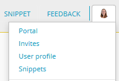
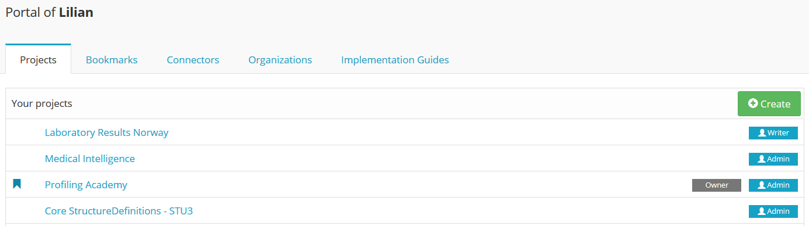
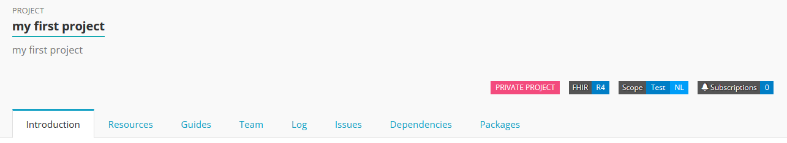
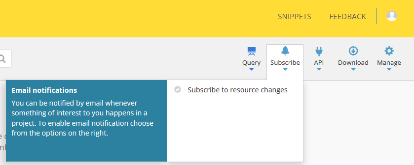
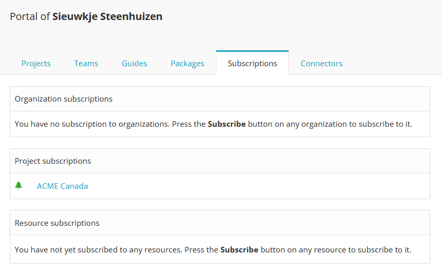
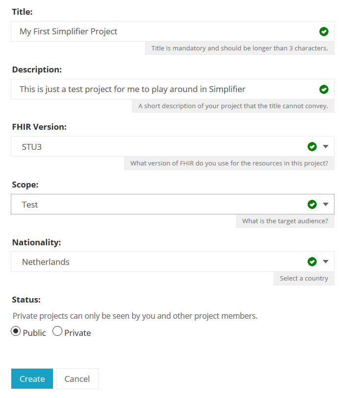
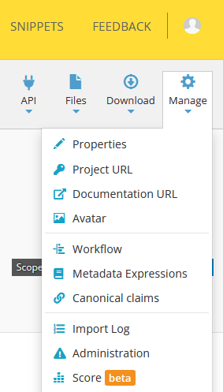
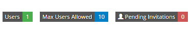
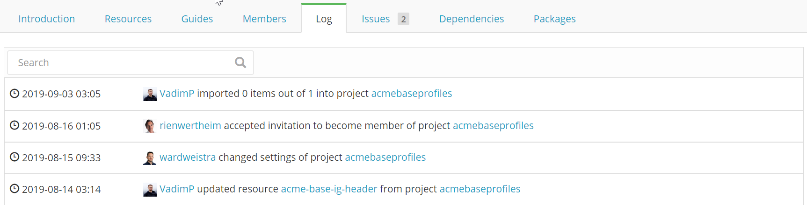

.. _Project_Page:

Projects
^^^^^^^^

.. important::

    Private and multiple projects are available from the Professional plan and up. `See the pricing page for details. <https://simplifier.net/pricing>`_

Simplifier organizes all content (e.g. resources and Implementation Guides) in projects. A project can be used to share all your FHIR resources and documentation with the community as well as to collaborate with other project members.

Open your project
"""""""""""""""""
For an overview of your projects, go to your `personal portal <simplifierPersonalContent.html>`_ by clicking on your avatar in the top right corner.

      
The Projects tab lists all projects you are involved in, either because you created the project yourself (making you the owner of the project) or because you are invited to the project as a project member.

      

Click on the title of a project to open its project page.

.. _project-page:

Project page
""""""""""""
Each project contains a couple of tabs depending on the settings of the project and your role in the project. The tabs described below are visible for each user in each Simplifier project.

      
   
Introduction
------------
This section serves as an overview of your project. This is a good area to share information about your project with people who may be team members or viewing your project for the first time. 

On the ``Introduction`` page of a project you can find:

- A summary text as added by the project owners
- A summary table describing the contents of the project:

	+ Number of resources per resource type
	+ Number of examples per resource

- The canonical base URLs supported in the project
- The workflow statuses supported in the project

When clicking on a resource type in the summary table (e.g. profiles) you navigate to the ``Resources`` tab, where the resources will be filtered on the selected resource type.

Resources
---------
On the ``Resources`` tab you can find all the Conformance and Example Resources for the project.
This tab also offers a search and filter option. You can filter your results to include or exclude certain Resource categories, Core base types, Example Resources type, FHIR status, and Workflow status. 
 
Guides
------
The ``Guides`` tab lists all Implementation Guides for this project built in Simplifier, one row per guide, with its versions and whether it is public or private. Click on a row to open its menu, with actions such as ``Edit``, ``Preview``, ``Versions`` and ``Publish``, depending on your role. The ``Guides`` tabs of your portal, organizations and teams use the same list. Use the `IG-editor <../features/simplifierIGeditor.html#implementation-guide-editor>`_ to create and edit Implementation Guides.
 
Team
----
On the ``Team`` tab you can find all project members and their role. This tab also offers a search option, allowing you to search for other members using their full name or username. Depending on your role in the project you can `add project members <simplifierProjects.html#id1>`_ here.

Log
---
On the ``Log`` tab you can see all the changes that have been made to this project in the past. This is a good way to stay in touch with what's happening within your favorite projects. 

Issues
------
On the ``Issues`` tab you can leave your issues regarding the project. Note that this tab is not visible in all projects. The :ref:`Issue Tracker <issue_tracker>` is a paid functionality that allows project members to collect feedback from other project members or (depending on the project settings) other Simplifier users.

Dependencies
------------
References to other profiles are resolved in your project first, and then in the packages your project depends on. A project can have several versions of the same package in scope; a pinned reference (``url|version``) uses exactly that version, and an unpinned one the most recent version in scope. See :ref:`canonical_resolution` for the rules, and :ref:`view_dependencies` to see what is in scope.

Releases
----------
The ``Releases`` tab shows all released FHIR package versions of a project. 

Subscriptions
"""""""""""""
To stay informed in real time click the ``Subscribe`` button in the top right. You do not have to be a member of a project to stay up to date on the latest developments. 

      
You can find your current subscriptions in your user portal under the ``Subscriptions`` tab:

      
Create a project
""""""""""""""""
In the Projects tab on your Portal page you can find the button labeled ``Create``. 

      

Clicking this button will allow you to create a new project by entering a Display Name, Description, and Scope. Once the project has been created you can then customize project information, add resources, add members, and follow changes that are occurring in that project.

      
.. note::
   DSTU2 can no longer be chosen for a new project. Existing DSTU2 projects stay online, and their resources still render and download, but Bake, file management, updating resources, importing, creating packages, GitHub and the ``Query`` menu are no longer available for them.

Project Management
""""""""""""""""""
You can always change your project settings by clicking on the ``Manage`` button in the right upper corner. There are a couple of options in the Manage menu, which will be explained below.

      
Properties
----------
Here you can edit the following properties: 

- The title and subtitle of your project
- The FHIR version (STU3, R4, R4B or R5)
- The scope of your project (core, international, national, institute, regional or test). As choosing the right scope will make it easier for others to find your project, please use test for all test projects and test projects only.
- Issue tracking by project members and other Simplifier users:
	- Turn issues on or off for this project (when activated the issues tab will be visible on the project page depending on the user's role)
	- With the issues visibility setting you can choose whether issues are visible to all Simplifier users or project members only. 
	- With the community issues setting you can choose whether all Simplifier users or only project members can create or respond to issues.
- Publishing project resources to the `FHIR registry <https://registry.fhir.org>`_ (registry.fhir.org). Note that this setting is only available in public projects. Private projects and test projects are excluded from the registry.

Project url
-----------
Here you can edit the URL key to your project on Simplifier, which is by default the name of your project. Be careful editing the URL key at a later stage as it will break all existing links to your project.

Documentation url
-----------------
If you have any external documentation on your project, you can add the link here.

Avatar
------
Choose this option to add your company logo or just any cool picture you like!

Workflow
--------
Here you can select one of the custom workflows of your organization to use it in your project. The workflows are configured and mapped to the FHIR workflow at the organizational level.

Metadata Expressions
--------------------
Here you can define how to extract metadata, like title, URL key, filename/path from a resource using FHIRPath. For more information also take a look at :ref:`Metadata Expressions. <Metadata_Expressions>`

Canonical claims
----------------
Here you can claim the canonical base URLs of your project. See :ref:`Canonical_Claims`.

Import log
----------
Use this option to retrieve a log with all uploads to your project. 

Administration
--------------
This option is only available for project members with an admin role. Use this option if you want to delete your project or if you want to change its visibility to either public or private.
Team Management
"""""""""""""""
.. important::

    Working with multiple users on a project is available from the Team plan and up. `See the pricing page for details. <https://simplifier.net/pricing>`_

The ``Teams`` tab displays a list of all the members with rights to that project. In this section you can invite Simplifier and non-Simplifier members to your project by clicking the ``Invite User`` button and typing in an email address. For more information on Team Management please look at our :ref:`Team Management page <Team_Management>`.

Along the top of the ``Teams`` tab you will find a summary of User information for your project. The number of users, the max users allowed for this project (in accordance with the type of plan you have), and the number of invitations you have pending (the number of users who have not yet accepted an invitation).  

      
Track Project Changes
"""""""""""""""""""""
On the ``Log`` tab you will find event tracking of a project. This log keeps a list of all changes made to resources within the project, along with the name of the person that made changes and the time the changes were made. 

At the top of the screen you will find the Atom feed button. This allows you to subscribe to stay informed about any changes being made within your projects. To utilize this feature, navigate to a project on Simplifier.net that you are interested in following. Once there click on the ``Subscribe`` button in the upper right hand corner and copy the link into a feed reader of your choice. You are then ready to start receiving updates. 

      
