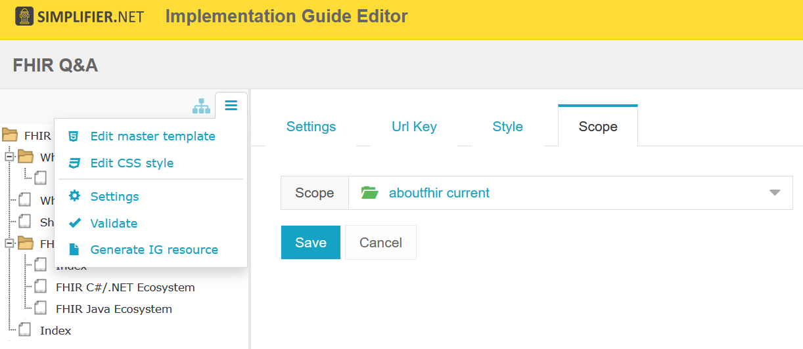
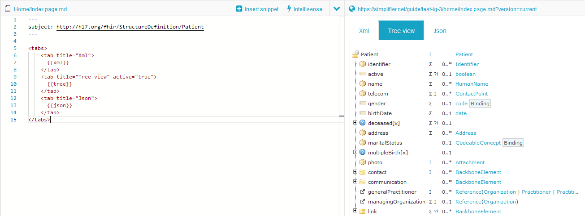

Create your first IG
====================

You can access the IG editor via the ``Guides`` tab in your project. Use the ``Create`` button to create a new Implementation Guide and provide a title for the IG. Simplifier will automatically generate a URL Key, but you can choose your own URL Key.

.. image:: ../images/ImplementationGuideCreate.png  
   :scale: 75%

Click on ``Browse`` or the Implementation Guide itself for a preview of the guide. Click on the ``Edit`` button to open the Implementation Guide in the IG editor. In the left bottom a help section is available to get started with adding images and tree renderings etc.

IG Editor Settings
^^^^^^^^^^^^^^^^^^
The IG editor opens on the page of the root folder. Simplifier stores newly created IGs in a folder based structure allowing users to easily ``copy`` guides and maintain multiple versions of their guides. 

To adjust the settings of your IG click on the Settings icon (the middle icon representing a gear wheel). This brings you to a section that allows you to adjust the title and privacy on the Settings tab, or select an IG rendering format and Stylesheet file on the Style tab. In the settings you are also able to select a ``scope`` for your guide. The scope determines where the rendered resources in your guide come from. You can set the scope to released packages or you live development project. 

.. image:: ../images/IGEditorSettings.png   
   :scale: 75%

The IG Editor consist of three sections. On the left is the IG's tree table which is used to define the outline of your IG and navigate between the pages of the IG. The middle section is the actual editor. The right section provides a preview of the actual IG page.   

By way of dragging the section bars you can adjust the size of each section to customize your view.

The IG folders work as follows:


- Home folder (1)
- Subsections folders (2)
- Subsection pages (3)
- Subsection page paragraphs (4)


In the IG Editor this looks like this: 

.. image:: ../images/IGeditorTreeHierarchy.png
   :scale: 75%

In the IG rendering, when using a custom balottable IG design, it looks like this:

.. image:: ../images/IGPageHierarchy.png
   :scale: 75%

The information on the ``index`` node is rendered on the Home, Subsections folder or Subsection pages. When more pages are added below the index file, these will be rendered as paragraphs for that page. If you want to use this, make sure the first page in a folder is named ``index``.

.. Tip::

    In the bottom left of the IG editor you will find the help tab with examples, tips, and tricks.

Markdown 
^^^^^^^^
In the middle section is a Markdown based editor used to compose your IG content. 
Markdown is a text-to-HTML conversion tool. 
It allows you to write using an easy-to-read, easy-to-write plain text format. 
The following link provides an overview of the Markdown features which can be used in this editor: https://github.com/adam-p/markdown-here/wiki/Markdown-Cheatsheet.

A short summary of frequently used features are as follows:

- Header size edits using ``#Header size 1`` to ``######Header size 6``
- Adding Emphasis, also know as italics, with ``*asterisks*`` or ``_underscores_``
- Adding Strong emphasis, also known as bold, with ``**asterisks**`` or ``__underscores__``
- Adding Combined emphasis with ``**asterisks``` and ``_underscores_**``
- Strikethrough uses two tildes. ``~~Scratch this.~~``

IG editor features
^^^^^^^^^^^^^^^^^^
The IG editor has features which allow you to include Simplifier content in your IG. 
These features work by using the statements written below in the editor. 
After adding these statements in the editor refresh the page, by pressing Crtl + Enter or clicking the Refresh button, to make them visible in the preview section. 

- ``{{tree:canonicalUrl}}``		                - renders a tree structure as seen in the resource overview tab
- ``{{json:canonicalUrl}}``		                - renders a json of the resource
- ``{{xml:canonicalUrl}}``		                - renders an xml of the resource
- ``{{table:canonicalUrl}}``		            - renders a table as seen in the resource table tab
- ``{{link:canonicalUrl}}``			            - provides a link to the specific resource page on Simplifier
- ``{{namingsystems:ProjectName}}``				- lists all namespaces of a project in a table
- ``{{render:canonicalUrl}}``                   - renders and parses any file type 
- ``{{source:canonicalUrl}}``                   - renders any filetype unparsed. In case of a profile, it will render the xml or json, and for an FQL file, it will render the script text

The following statements add an index within the IG. 

- ``{{index:root}}``	- gives an index of the entire IG 
- ``{{index:current}}`` - gives an index of the current selected element

The location of the rendered resources is based on the scope of the IG as set in the settings. 
You can find this scope when you navigate to the settings of the IG editor and click the "Scope" tab:



Tree and Render properties
^^^^^^^^^^^^^^^^^^^^^^^^^^
The ``tree`` and ``render`` widgets have properties that you can set, allowing you to specify how these widgets should render files. These properties are listed below:

    - The ``tree`` widget has the option to show either the ``diff``, ``snap``, or ``hybrid`` form of your resource.

            ::

                {{tree:http://hl7.org/fhir/StructureDefinition/Patient, diff}}
                {{tree:http://hl7.org/fhir/StructureDefinition/Patient, snap}}
                {{tree:http://hl7.org/fhir/StructureDefinition/Patient, hybrid}}

    - Buttons: Rather than showing only one of the above renderings, the ``buttons`` property will show the three ``diff``, ``snap``, and ``hybrid`` buttons for the tree on a guide page.

            ::

                {{tree:http://hl7.org/fhir/StructuurDefinities/Patient, buttons}}

    - Expand: You can use the ``expand`` property for full expansion of your resource tree, or you can give a number for the level of expansion:
            
        ::

            {{tree:http://hl7.org/fhir/StructureDefinition/Patient, expand}}
            {{tree:http://hl7.org/fhir/StructureDefinition/Patient, expand: 2}}

    - Language: The ``lang`` property allows you to switch the language of the rendering to the provided language, if it is available:

        ::

            {{tree:http://hl7.be/fhir/be/StructuurDefinities/Patient, lang: fr-BE}}

Page Headers
^^^^^^^^^^^^
The YAML header of a markdown page (the part between the ``---`` lines) is a place to set properties that should affect the entire page. This is an example of how a YAML header can be configured:


    ::

        ---
        topic: MyPatientPage
        name: ACMEbasePatient
        expand: 2
        ---


**Topic**

As is :ref:`described below <pagelinkingTopic>`, you can set the ``topic`` of the page like this, but with the release of Simplifier 30.5 it is possible to set any properties here that can also be used in the rendering widgets.

**Subject**

If you would for example place the ``canonical`` or ``name`` property (the canonical or name of the resource) in the page header, all ``tree``, ``xml`` and ``json`` widgets in the page will no longer need the canonical as their parameter, making it a lot easier to create and maintain.

**Language**

If you are using the language extension, you can set the ``lang`` property in the header this will automatically affect all renderers who understand the language property:

    ::

        ---
        lang: nl-BE
        ---


**Other properties**

``expand`` This option can be set to ``1``, ``2`` etc. and will expand the tree view to the requested depth. Setting this to ``yes`` will fully expand the tree view. This works for both StructureDefinitions and Example instances.

Other properties you might consider to use here are the aforementioned properties, such as the ``buttons``, ``diff``, and ``hybrid`` properties.


Creating tabs
^^^^^^^^^^^^^
You can create tabs in a guide page using the following syntax:

    ::

        <tabs>
            <tab title="Overview">
              {{tree:http://hl7.org/fhir/StructureDefinition/Patient}}
            </tab>
            <tab title="Xml" active="true">
              {{xml:http://hl7.org/fhir/StructureDefinition/Patient}}
            </tab>
        </tabs>

By default, the first tab in the above snippet will be active. If you would like the second tab to be active you can use the ``active="true"`` setting as shown above.
An example of how these tabs will look like is given below:



Formatting style
^^^^^^^^^^^^^^^^

An IG can be rendered in one of three formats: a Tree table, Two Level Menu or HL7 format(work in progress).

A Tree table rendering will display your IG with the elements in a format similar to the tree table with the elements and their hierarchy along the left side of the page.

.. image:: ../images/IGTreeNavigation.png
   :scale: 75%


A Two Level Menu rendering will display your IG with the elements in tabs along the top of the page.

.. image:: ../images/IGHorizontalNavigation.png
   :scale: 75%

A HL7 format rendering will display your IG with the elements in tabs along the top of the page similar to the Two Level Menu rendering, but in the style of a HL7 IG.

Every folder contains an index file which will be displayed as the folders homepage. Every folder can have child pages which can be added with the ``+`` icon. In the image below you can see the folder structure on the left and on the right de rendering of the Implementation Guide: 

.. image:: ../images/FolderStructure.png
   :scale: 75%


FQL table generation
^^^^^^^^^^^^^^^^^^^^

With the introduction of FQL  it is now possible to create dynamic tables in your IG. FQL tables retrieve information from the resources in the select scope. Below is an example of the syntax. For more information and examples please look at our `documentation <https://simplifier.net/docs/fql>`_.

.. code-block:: SQL

    
    @```

    from <your recources>
    where <option>
    select <what you want in the table>
    
    ```

You can also save your FQL statements in order to re-use them on different pages and even in different projects. In the IG editor, the option for saving your custom snippets is available. This will save your statements in a .snippet.md file which is than usable within every IG page in that specific project. The .snippet.md file(s) can be downloaded and uploaded in different projects to use them across your organization. 


 .. image:: ../images/IGEditorSnippets.png
   :scale: 75%

It is also possible to use HTML style tags to embed FQL code in your page. For that you can use the following tags: ``<fql>``.


.. _pagelinkingTopic:
Pagelink using page topic
^^^^^^^^^^^^^^^^^^^^^^^^^


With the ``pagelink`` command you can create a link to a different page in your Implementation Guide: 

.. code-block:: 

    {{pagelink:<url key for the markdown resource describing the page>}}
    
You can find the url key for the markdown resource describing the page you want to link to with the help from the pagelink autocomplete, or by looking at the address bar when opening the resource describing the page from your project's Resources tab.

When a URLkey for a page that is referred to or one of the folders it is in changes, the pagelink might break. For that reason, we created a more robust way of linking to pages within a guide with the use of ``topic``. 

In an Implementation Guide page you can set the ``topic`` by starting the page with a topic in the yaml header:


.. code-block:: yaml

    ---
    topic: yourpagename
    ---

Using the topic in your pagelink ``{{pagelink:yourpagename}}``, this will prevent the links from breaking even when creating copies of your guide. 


Linking examples
^^^^^^^^^^^^^^^^^

The recommended way to link to examples or other resources is by resource id. This will ensure that the links will keep working even when the guide is exported or duplicated. 
The rendering will work with Link, xml and json. Make sure to always provide a ResourceType when linking: 

.. code-block::

    {{Link/xml/json: ResourceType/id}}


For example:

.. code-block::

    {{link: Patient/child-example}}

Or the json rendering of the example resource:

.. code-block::

    {{json: Patient/child-example}}

