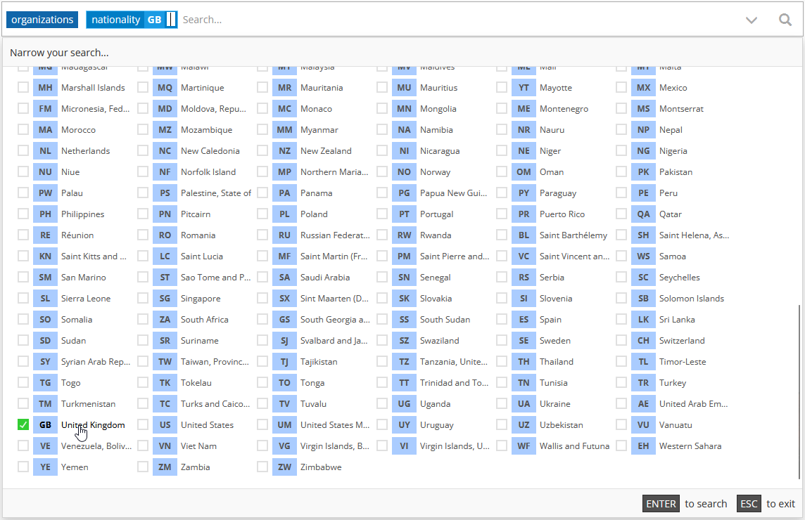
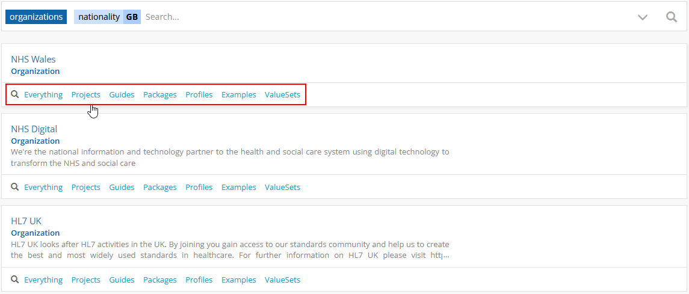
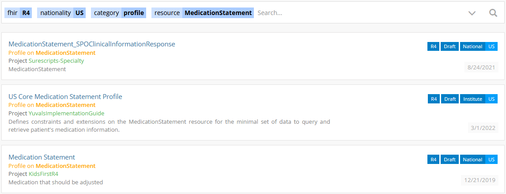
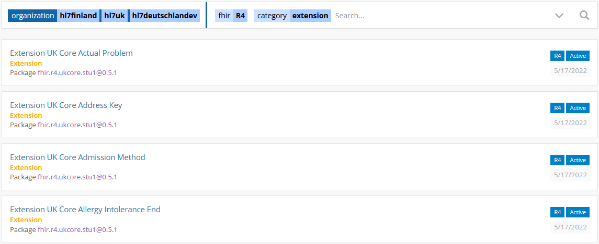

Searching on Simplifier
========================

Simplifier's search has now been superchared on Elastic! Elastic gives Simplifier almost endless options in searching so let's explain how this works. You can press the down arrow on your keyboard of click in the searchbar when you are in the search UI and Simplifier will show all the categories you can search for and within. 

With the new search you can search for and within entities and specify specific attributes you want to find. Pressing the down arrow while in the searchbar or clicking the looking glass icon will give you an overview of all the search and filter options.

Let's start off with an example of how you can search for the latest publication of the UK core profiles. 

From the available filters you can start by selecting the ``Organization`` Entity followed by the attribute ``Nationality`` set for UK. 

This gives you a list form all the available organizations in the UK. In the UI you can directly click on projects or packages to see what one of those organizations has published. Clicking on packages from HL7 UK gives you a list of the published packages available on Simplifier. 

One of the core pillars of Simplifier, is providing the users with the best governance possible. With our new and improved search users can now search withing jurisdictions and organizations for resources to help prevent unnecessary duplication. The Elastic search allows for easy searching within organiations or nationalities for already existing profile.

Lets give another example: 

You want to find all the R4 MedicationStatements available in the US. You can select your FHIR version, nationality, category and resource type as shown in the screenshot below. 

You perform a similar search to find all profiles created by a certain Organization or even mutliple Organizations. See for example a search for available valuesets published by different HL7 organizations.

Below you will find some more examples on how to serach for specific content on Simplifier.

To search for specific resources: 

Set your ``FHIR version`` + ``Category`` Profiles + ``Resource`` Resource type + possible other filters like Nationality.

To search for packages:

``Packages`` + ``Organization``
``Packages`` + ``Nationality`` only works when Juristiction is added to a package. See for example what happens when you set the nationality to UK, DK or US.

To search for Projects:

Select ``projects`` + any further filter you want like nationality, organization and/or fhir version.