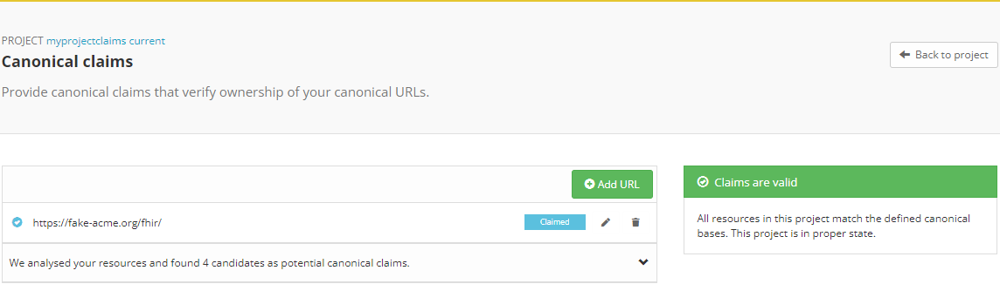
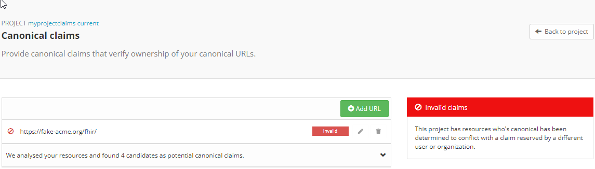
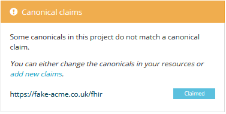
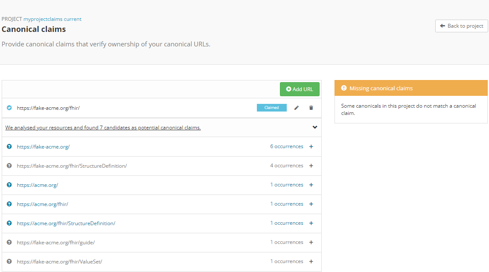
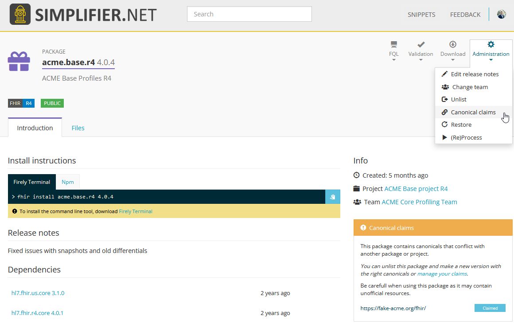
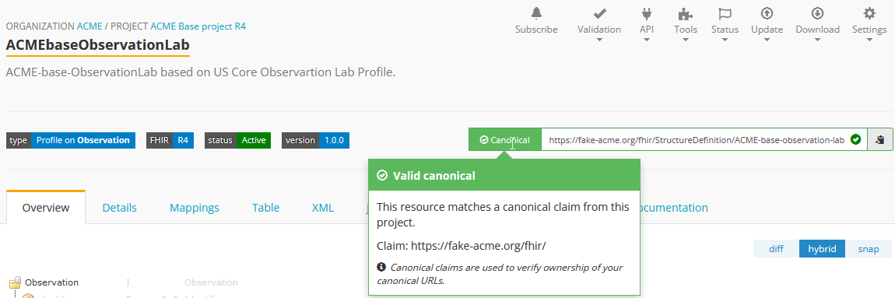
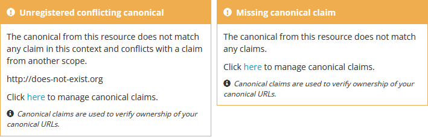
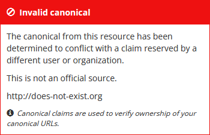

.. _Canonical_Claims:
Canonical Claims
^^^^^^^^^^^^^^^^

Canonical Claims are used and recognized as a certificate or a proof of origine for your resources. You can claim canonicals on a package and project level. 

Canonical claims on Project level
----------------
On a project level you can claim a canonical under the ``Canonical claims`` option in the project Manage dropdown. On the Canonical claims page you can see the claimed canonicals and the status of the claims made in the project. 

If a canonical is claimed you declare ownership of this canonical claim. If another user disputes your claim, and has the legitimate claim, a site admin can set your canonical claim as invalid. Please reach out to us if you want to open a dispute about invalid Canonical Claims. 

If your project contains resources with a canonical base that is not claimed, Simplifier will show a warning on the Project page. 

Under the ``Canonical claims`` option Simplifier will show you wich canonical claims you are missing. 

Of course this could indicate that some of your resources have an unintended canonical (base) url. You can create custom bulk validation rules to validate your entire project using our :ref:`Quality Control <QC>` feature. 

Canonical claims in packages
----------------------------
After a package is created the canonicals can be managed under the package Administration. 

The status of the Canonical Claims is the same as on a project level. 

Canonical claims on a resource level
------------------------------------
Every resource in a project will have a status next to the canonical url indicating if the base was claimed by the project. 

The status can also be a warning that the canonical base was not claimed by the project or an error stating that this is an invalid canonical. 

If the canonical claim of the resource is already claimed by another organization or user the status of the canonical url will be invalid.

Canonical claims best-practice
------------------------------
When adding canonical claims to your project or package we recommend using the longest common denominator. 
For users who generated Implementation Guide resources from our IG editor, the default canonical base for those IG resources is ``https://simplifier.net/guide``. Everyone is allowed to claim this canonical in their project and packages. 

