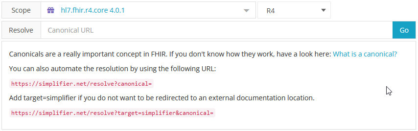

Documentation Redirection
^^^^^^^^^^^^^^^^^^^^^^^^^
Each project and resource in Simplifier has a Documentation URL. 
If set, users that go to https://simplifier.net/resolve and enter a canonical URL will get automatically directed to that documentation url. The default (fallback) will be the resource page on Simplifier itself. 

Although for STU3 the scope ``All of Simplifier`` does work, it is best practice to select a package or a project as the scope. This ensures that the user is redirected to the intended location. 

Resolving canonicals in FHIR R4 requires the use of a package (or project) scope and setting the FHIR version to R4. By default Simplifier will select the package ``hl7.fhir.r4.core 4.0.1``. 

You can set the documentation URL of a single resource, but you can also set the the documentation URLs of all 
resources in the project, because Simplifier works with templates for the documentation URL.  

To edit a documentation URL choose the ``Settings`` menu on a resource page or on the project page.
Then choose ``Documentation URL``.

You can choose several variable parts, like the projectkey or file key that we use in the URL in Simplifier and you can
use several fields in your resource: the id, type, the profile base type, and the canonical URL itself.
This allows you to just define one project level URL that will work for all resources on your project.

If no documentation URL is provided, Simplifier will default to the page on Simplifier itself as the location of your documentation.
 
