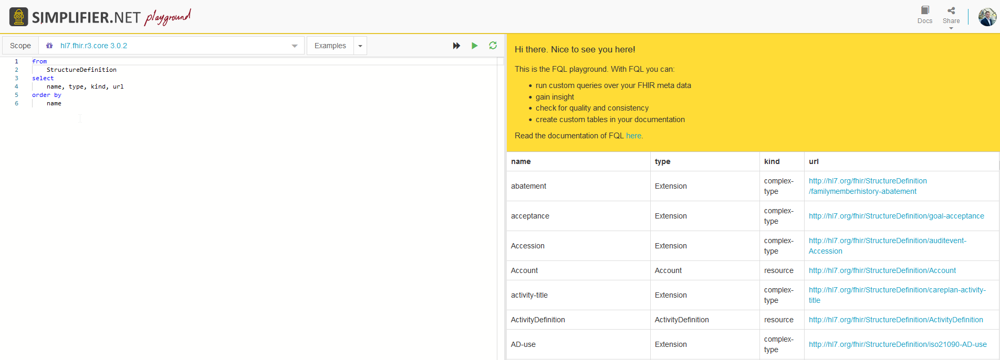
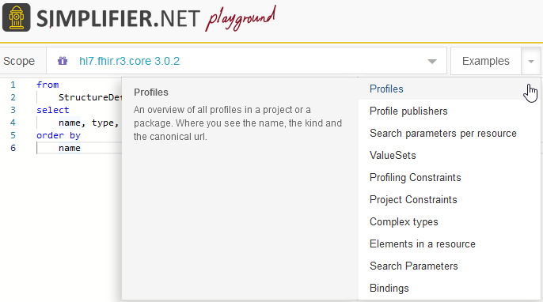
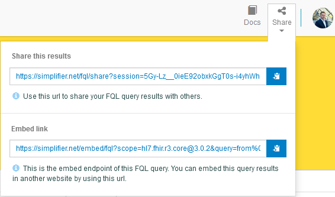

FQL 
===

FQL is a query language that allows you to retrieve, filter and project data from any data source containing FHIR Resources. It brings the power of three existing languages: SQL, JSON and FhirPath.

`Find our full documentation and examples on FQL on Simplifier. <https://simplifier.net/docs/fql>`_

FQL Playground
--------------

On Simplifier we have the `FQL playground<https://simplifier.net/fql>` available where you can try running your own queries in a scope of your choice. 

As a scope you can select any publicly available package or project. You can run one of our example queries to get a quick understanding of all the possibilities with FQL. 

You can also share the query you made with other Simplifier users or embed your query output in another website. 

