Implementation Guide Editor
===========================
The Implementation Guide Editor on Simplifier enables you to make implementation guides (IGs) using the resources available in Simplifier. You can include your own project's Resources, package resources or those from others in your IG. 
With the help of this Markdown based editor you can easily construct an organized and practical IG that is both easy to read and navigate. This IG editor is available in all Simplifier account plans. Visit https://simplifier.net/pricing for more details.

This page will elaborate further on getting started and how you can use the IG editor.

Create your first IG
--------------------
You can access the IG editor via the ``Guides`` tab in your project. Use the ``Create`` button to create a new Implementation Guide and provide a title for the IG. Simplifier will automatically generate a URL Key, but you can choose your own URL Key.

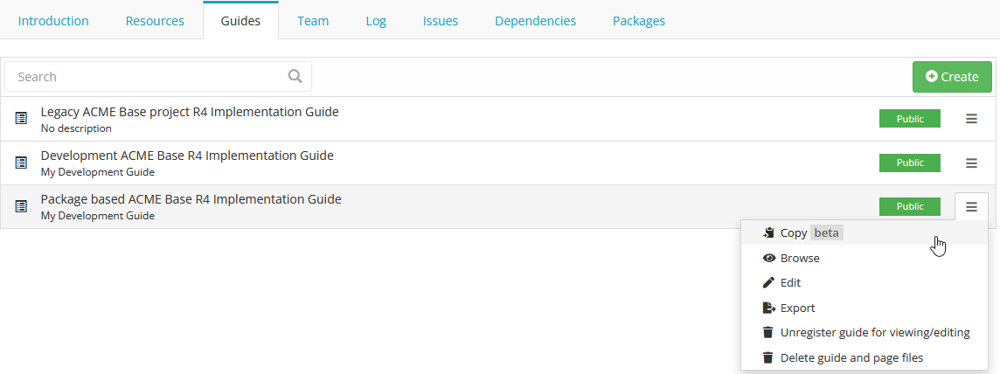

Click on ``Browse`` or the Implementation Guide itself for a preview of the guide. Click on the ``Edit`` button to open the Implementation Guide in the IG editor. In the left bottom a help section is available to get started with adding images and tree renderings etc.

IG Editor Settings
^^^^^^^^^^^^^^^^^^
The IG editor opens on the page of the root folder. Simplifier stores newly created IGs in a folder based structure allowing users to easily ``copy`` guides and maintain multiple versions of their guides. 

To adjust the settings of your IG click on the Settings icon (the middle icon representing a gear wheel). This brings you to a section that allows you to adjust the title and privacy on the Settings tab, or select an IG rendering format and Stylesheet file on the Style tab. In the settings you are also able to select a ``scope`` for your guide. The scope determines where the rendered resources in your guide come from. You can set the scope to released packages or you live development project. 

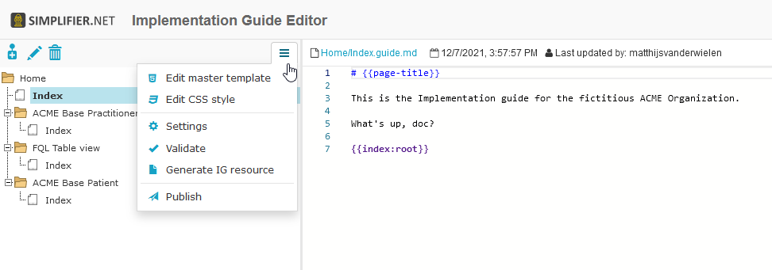

The IG Editor consist of three sections. On the left is the IG's tree table which is used to define the outline of your IG and navigate between the pages of the IG. The middle section is the actual editor. The right section provides a preview of the actual IG page.   

By way of dragging the section bars you can adjust the size of each section to customize your view.

The IG folders work as follows:


- Home folder (1)
- Subsections folders (2)
- Subsection pages (3)
- Subsection page paragraphs (4)


In the IG Editor this looks like this: 
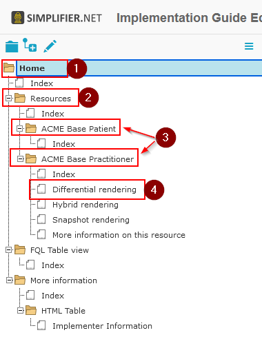


In the IG rendering, when using a custom balottable IG design, it looks like this:
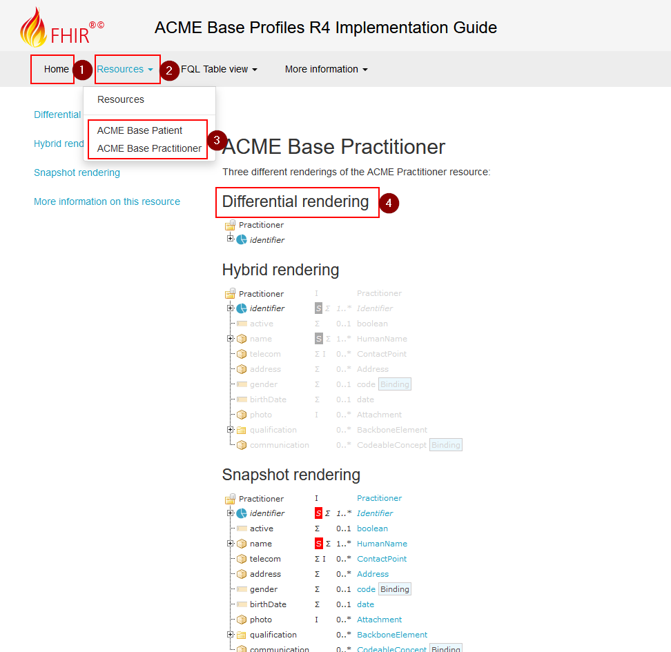

The information on the ``index`` node is rendered on the Home, Subsections folder or Subsection pages. When more pages are added below the index file, these will be rendered as paragraphs for that page. If you want to use this, make sure the first page in a folder is named ``index``.

Markdown 
^^^^^^^^
In the middle section is a Markdown based editor used to compose your IG content. 
Markdown is a text-to-HTML conversion tool. 
It allows you to write using an easy-to-read, easy-to-write plain text format. 
The following link provides an overview of the Markdown features which can be used in this editor: https://github.com/adam-p/markdown-here/wiki/Markdown-Cheatsheet.

A short summary of frequently used features are as follows:

- Header size edits using ``#Header size 1`` to ``######Header size 6``
- Adding Emphasis, also know as italics, with ``*asterisks*`` or ``_underscores_``
- Adding Strong emphasis, also known as bold, with ``**asterisks**`` or ``__underscores__``
- Adding Combined emphasis with ``**asterisks``` and ``_underscores_**``
- Strikethrough uses two tildes. ``~~Scratch this.~~``


The IG editor has features which allow you to include Simplifier content in your IG. 
These features work by using the statements written below in the editor. 
After adding these statements in the editor refresh the page, by pressing Crtl + Enter or clicking the Refresh button, to make them visible in the preview section. 

- ``{{tree:canonicalUrl}}``		                - renders a tree structure as seen in the resource overview tab
- ``{{table:canonicalUrl}}``		            - renders a table as seen in the resource table tab
- ``{{link:canonicalUrl}}``			            - provides a link to the specific resource page on Simplifier
- ``{{namingsystems:ProjectName}}``				- lists all namespaces of a project in a table


The location of the rendered resources is based on the scope of the IG as set in the settigns.  


The following statements add an index within the IG. 

- ``{{index:root}}``	- gives an index of the entire IG 
- ``{{index:current}}`` - gives an index of the current selected element


Formatting style
^^^^^^^^^^^^^^^^

An IG can be rendered in one of three formats: a Tree table, Two Level Menu or HL7 format(work in progress).

A Tree table rendering will display your IG with the elements in a format similar to the tree table with the elements and their hierarchy along the left side of the page.

.. image:: ./images/IGTreeNavigation.png

A Two Level Menu rendering will display your IG with the elements in tabs along the top of the page.

.. image:: ./images/IGHorizontalNavigation.png

A HL7 format rendering will display your IG with the elements in tabs along the top of the page similar to the Two Level Menu rendering, but in the style of a HL7 IG.

Every folder contains an index file which will be displayed as the folders homepage. Every folder can have child pages which can be added with the ``+`` icon. In the image below you can see the folder structure on the left and on the right de rendering of the Implementation Guide: 

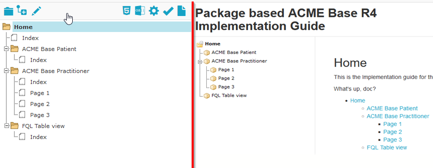

FQL table generation
^^^^^^^^^^^^^^^^^^^^
With the introduction of FQL  it is now possible to create dynamic tables in your IG. FQL tables retrieve information from the resources in the select scope. Below is an example of the syntax. For more information and examples please look at our `documentation <https://simplifier.net/docs/fql>`_.

.. code-block:: SQL

    
    @```

    from <your recources>
    where <option>
    select <what you want in the table>
    
    ```


IG Storage
----------
Since release 28.0 IG's all files belonging to an IG are saved in the same folder. No longer in the root of the project and not in different folders. The folder name will be the same as the IG name. 

To illustrate how this works, see the screen picture of an example IG containing three topics with one or more pages for each topic. In the project's filemanager you can see the different folder structures for each guide. 

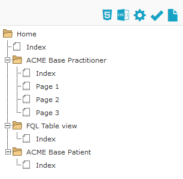
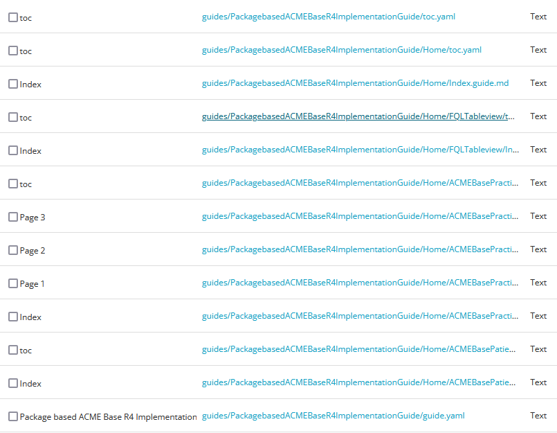

To Save your IG as a Resource, click on the ``Generate IG resource`` button in the left pane of the IG-editor. Note that it is the tree structure that is saved. Textual changes are save automatically.

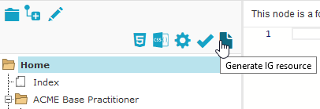


Export your IG
--------------

.. important::

    `This feature is available from the Professional plan and up <https://simplifier.net/pricing>`_.

To use your IG outside of Simplifier, click on the Export button next to your IG in the Guides section of your project. 

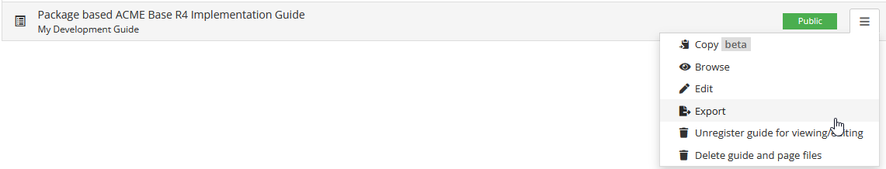


Convert guide.yaml to a Simplifier webbased IG.
-----------------------------------------------

Sometimes you see an implementation guide on Simplifier that just simply blows you away and you want to see how this has been created. Luckily, you can create a copy of those guides in a project of your own and take a look at their IG editor content. 

Guides created after August 2021 are stored in the new folder based storing way. These implementation guides can still be converted to a Simplifier webbased IG in a (private) project using the guide.yaml file. 

Please follow these steps to create your own edition of a Simplifier IG. 

1. Download the project containing the desired guide as a .zip file.
   
2. Upload the .zip to (preferably private) project.
   
3. Go to ``manage`` > ``File manager``. 
   
4. Search for guide.yaml. 
   
5. Open desired guide.yaml for the guide you want to create. 
   
6. Click on ``Update`` followed by ``Edit: Create IG and start updating in IG Editor``.

7. Wait for the IG to be created and you are good to go. 


Convert ImplementationGuide resource to a Simplifier webbased IG
----------------------------------------------------------------

.. important::

    This feature only works for Legacy guides in order to ensure backwards compabibility and will therefore create a guide in the legacy way of Markdown files.

An ImplementationGuide resource can be converted to a Simplifier webbased IG. This comes in handy if you for example accidently deleted your IG or if you want to duplicate your IG in another project.

- Make sure that the project contains the ImplementationGuide resource and all the belonging content (.md pages, images, etc.)

-	Locate the an ImplementationGuide resource. 

-	Click on ``Update`` followed by ``Edit: Create IG and start updating in IG Editor``. This will convert the ImplementationGuide resource to a Simplifier IG. 

- Follow the configuration steps and locate the IG in the Guides tab.

**Note**: If you want to export and import a project through a .zip you have to make sure that the folder structure is the same as in the project, to make sure links between IG resources are still in tact. Zipping a containing folder will include the folder in the zip-file. To make sure no extra layer of folders is added, directly zip the resources within a folder instead.


Create a copy of your IG
------------------------
Since the release of Simplifier 28.0 it is possible to create a copy of your Implementation guide. Due to the complexity of the feature it is currently (21-01-2022) a beta release. 

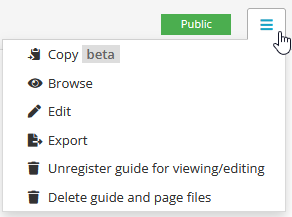

A guide can be copied to the same project or to another project. The ``Target project:`` dropdown provides an list of all of your projects where you can create a copy of your IG. 

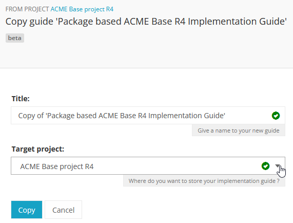

You can now have multiple version of your Implementation Guide live in the same project (or different projects). You could have one IG use a release package as the scope while the development version uses the live developement version of your project. 


Migrating your legacy Guide
---------------------------

Guides created before Simplifier 28.0 are still stored in the legacy way as separate markdown files. These guides first have to be migrated to the new way of storing guides. 

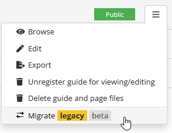

This functionality is also a beta release so please follow the warning and migration steps in the Migrate Guide window. In the Migrate Guide window a different target project can also be selected. Migrating a guide **does not** delete the legacy guide. 

After a guide is migrated or copied, please make sure all your internal page links and references are still working. 


Manage your IG using GitHub
---------------------------
The GitHub webhook allows managing your Implementation Guide, without using the editor itself. You can find more information on how to set this up in the :doc:`GitHub integration documentation<simplifierGithub>`.


Pagelink using page topic
-------------------------

With the `pagelink` command you can create a link to a different page in your Implementation Guide: `{{pagelink:<url key for the markdown resource describing the page>} }` (without the space). You can find the url key for the markdown resource describing the page you want to link to with the help from the pagelink autocomplete, or by looking at the address bar when opening the resource describing the page from your project's Resources tab.

When a URLkey for a page that is referred to or one of the folders it is in changes, the pagelink might break. For that reason, we created a more robust way of linking to pages within a guide with the use of ``topic``. 

In an Implementation Guide page you can set the ``topic`` by starting the page with ``topic: yourpagename`` and using the topic in you pagelink ``{{page:yourpagename}}``. This will prevent the links from breaking. 


Customizable IG design 
----------------------
.. important::

    `This feature is available from the Team plan and up <https://simplifier.net/pricing>`_.


Placeholders
^^^^^^^^^^^^
When you are customizing your stylesheet and editing the master HTML template you will notice we have some placeholders available in our templates. 

We have different types of placeholders.  

Information retrieved from the IG settings:
""""""""""""""""""""""""""""""""""""""""""""

* **guide-title** - Renders the guide title.
* **guide-version** - Renders the guide version.
* **guide-fhir-version** - Renders the FHIR version of the IG.


Internal IG content placholders:
""""""""""""""""""""""""""""""""

* **page-title** - Renders page title as specified in the IG's tree table. 
* **page** - Renders the navigation index on the right side.
* **page-withe-children** - Renders the index tree on the left side. 
* **footer** - Renders the Simplifier footer at the bottom of your IG pages. 
  
Style specific placeholders:
""""""""""""""""""""""""""""


In your Implementation guide you can select three differerent templates: the Ballotable(work in progress), TreeTable and Two Level Menu. If you have a Team plan and up you can customize these as you see fit. It will be worth noting that there a several placeholders specifically made for these templates. 
When using the TreeTable:

* **tree-navigation** - Adds a rendering of the tree to the left side of the IG page. 

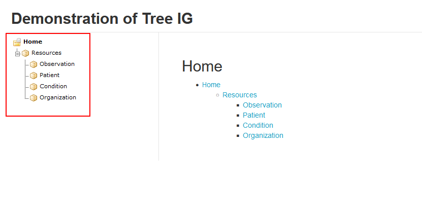

When using the Two Level Menu:
""""""""""""""""""""""""""""""

* **dropdown-navigation** - Creates a navigation bar with all folders added as items. When a folder has a child page it will render as a dropdown menu. 
* **dropdown-navigation-with-title** - Creates a navigation bar similar to **dropdown-navigation** and adds the IG title as a 'home' button to the left of the navigation bar as seen in the image below. 

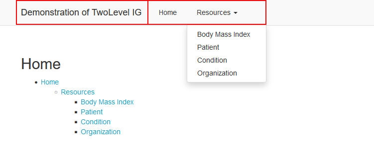

Stylesheet specific placeholders: 
""""""""""""""""""""""""""""""""""
We do not recommend you alter these unless you have a specific desire to use an older style sheet for a specific version of your guide. 

* **content** - Provides the api for where we resolve the static files. Default templates are resolved from the webserver file server, if a CSS is available we resolve from there. 
* **style-folder** - Provides the folder of your custom style sheet.
* **version** - Specifies the specific version of you style sheet. By default it will select the latest version. 


CSS-editor
^^^^^^^^^^

For our Enterprise Licenses the feature "Custom Layout" is available. Here you can create your own custom master template (HTML) and choose your own layout (CSS). When you click on the dorpdown icon in the IG-editor, the CSS-editor will be opened. 


With this editor you can edit your Style Sheet to make overall changes in the overall look and feel of your IG. For example, you may change the color of the navigation bar to blue or add your own logo to it. It is also possible to reset your changes by going back to the original CSS or download the original CSS as a seperate file, so you can compare the differences with your own code.

Here below are a couple of examples that you can use to configure the lay-out of your IG:

.. code-block:: CSS

  /* Change menu bar font color (title, menu & submenu) */
  #ig-viewer .ig-view-content #ig-view-twolevelmenu .header .navbar a {
      color: white;
  }

.. code-block:: CSS
     
    /* Change menu bar background color (only main menu) */
    #ig-viewer .ig-view-content #ig-view-twolevelmenu .header .navbar {
          background-color: red;
    }

.. code-block:: CSS

    /* Change menu bar font color (only main menu) */
    #ig-viewer .ig-view-content #ig-view-twolevelmenu .header .navbar-nav > li > a {
        color: green;
    }

.. code-block:: CSS

    /* Change menu bar hoover item background color and font color (only main menu) */
    #ig-viewer .ig-view-content #ig-view-twolevelmenu .header .navbar-nav > li > a:hover {
        background-color: black;
        color: red;
    }

.. code-block:: CSS

    /* Change menu bar background color (only submenu) */
    #ig-viewer .ig-view-content #ig-view-twolevelmenu .header .navbar .dropdown-menu {
        background-color: yellow;
    }

.. code-block:: CSS

    /* Change menu bar font color (only submenu) */
    #ig-viewer .ig-view-content #ig-view-twolevelmenu .header .navbar .dropdown-menu a {
      color: black;
    }

.. code-block:: CSS

    /* Set logo by using an external image */
    #ig-viewer .ig-view-content #ig-view-twolevelmenu .header a.navbar-brand {
        color: transparent;
        background: url('http://image.png');
        background-position: left center;
        background-size: contain;
        background-repeat: no-repeat;
    }
    
.. code-block:: CSS 

    /* Set the font color of your headers */
    h1, h2, h3, h4{
        color: #DF0101;
    }
    /* Set a background color to level 2 headers */
    h2{
        background-color: #eeecec;
        padding: 0.5em;
    }


