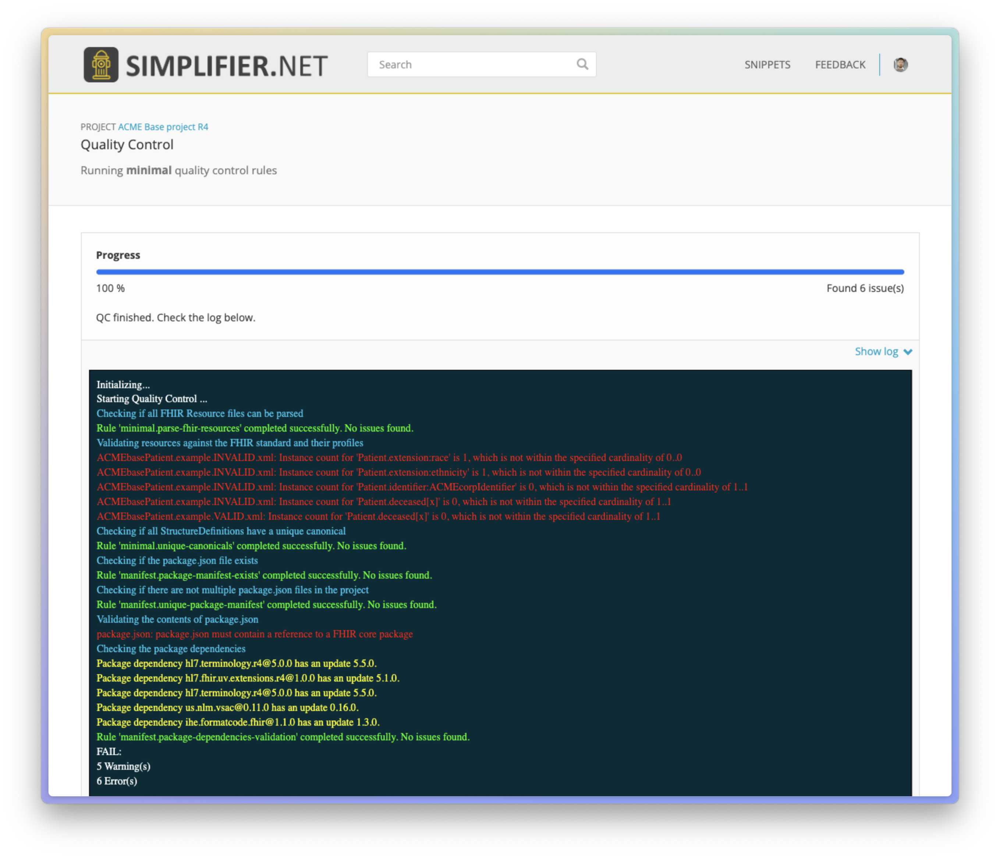

.. _release_notes:

Release Notes
=============

This page contains the release notes of the current major version of simplifier.net (30.6.0), as well as release notes from previous releases.

Current release
~~~~~~~~~~~~~~~

Release Simplifier 31.4, June 5th, 2024
----------------------------------------

The Simplifier 31.4 update focuses on technical improvements and maintenance, ensuring a smoother and more efficient experience for our users. Here are the key highlights:

Quality Control Enhancements
^^^^^^^^^^^^^^^^^^^^^^^^^^^^

We've introduced new rules and filters to improve quality control:

-  **unique-filename**: Checks for duplicate files in package builds.
-  **assert**: Can now check for any issue, or issues of specified severity (warning, error, or info).
-  New predicates: **exists, min, max, count, and cardinality**.
-  **manifest**: Evaluates the correctness of ``package.json``.
-  **dependency**: Provides a full analysis of your dependency closure, including upgrade suggestions.

Here is an example of the new rules for chekcing the package manifest and package dependencies, as part of the minimal validation rules:



We've also made all rulesets used by Simplifier publicly visible in our Assets project, like these `minimal rules <https://simplifier.net/assets/qualitycontrol-minimal>`_. (Note that it is not yet guaranteed that Forge and Firely Terminal use the exact same version of the rules.)

Rendering Improvements
^^^^^^^^^^^^^^^^^^^^^^^

-  **Markdown Rendering**: Now available in all rendering components.
-  Enhanced rendering of pattern elements: When a pattern was set on a parent element, child elements were mistakenly rendered as being `fixed` instead of being affected by a `pattern`.

Other Enhancements
^^^^^^^^^^^^^^^^^^^

-  **YamlGen**: Now generates random content for backbone elements.
-  **FQL**: Can now filter on categories "Profile", "Example", "Extension".
-  FQL syntax update: Correctly parses the FhirPath expression ``(<expression>).not()``.
-  Numerous textual improvements and fixes.
-  Guides markdown frontmatter (YAML) IntelliSense: Typing `canonical:` will trigger autocomplete for the canonical URLs in scope.
-  Improved package publication, allowing users to upload/publish packages directly through the Simplifier API.

Versioning Update
^^^^^^^^^^^^^^^^^

Starting from the next release, our versioning will follow the current year followed by the release number. The next release will be 2024.5.

Known issues
^^^^^^^^^^^^

As of this moment no issues are listed for this version of simplifier yet. If you come across an issue and it is not listed here, please contact us at
simplifier@fire.ly or (for customers) `our premium support desk <https://firely.atlassian.net/servicedesk/customer/portals>`_. 

If you experience service lags in Simplifier.net, it could be that services are offline. You can check if this is the case on `Simplifier.net's status website <https://status.simplifier.net/>`_.
It is also possible to raise an issue from here.

All our tooling is built on top of the official Firely .NET SDK developed and managed by Firely. The `SDK is open source
and maintained on Github <https://github.com/FirelyTeam/firely-net-sdk/>`_ and `issues are publicly tracked there <https://github.com/FirelyTeam/firely-net-sdk/issues>`_.

HL7 is maintaining a `known issue list for the FHIR specifications on
their Confluence <https://confluence.hl7.org/display/FHIR/Known+Issues+with+the+published+FHIR+Specifications>`_.

Previous releases
~~~~~~~~~~~~~~~~~

Release 31.3, April 29th, 2024
------------------------------

We are excited to announce the release of Simplifier 31.3, featuring the new "Products" functionality! This update brings a range of new capabilities designed to enhance your experience and streamline your workflow.

Products (Alpha Release)
^^^^^^^^^^^^^^^^^^^^^^^^^

The highlight of this release is the introduction of the "Products" feature, which allows organizations to advertise private FHIR content products directly through the Simplifier marketplace for FHIR. In this initial alpha release, you can add Published Guides and private Packages as product components. This feature includes several new pages to support the product lifecycle:

-  **Marketplace**: Browse available products.
-  **Product Cart**: Manage items you wish to purchase.
-  **Checkout**: Complete your purchase securely.
-  **Purchased Products**: View and manage your purchased items.
-  **Product Creation/Edit Page**: Create and edit your products.
-  **Product Page**: Detailed view of individual products.

Please see the below demo for a full overview:

.. raw:: html

    <div style="position: relative; margin-bottom: 2em; overflow: hidden; max-width: 100%; height: auto;">
        <iframe width="560" height="315" src="https://www.youtube.com/embed/AE-sytb1MWY" frameborder="0" allow="accelerometer; autoplay; clipboard-write; encrypted-media; gyroscope; picture-in-picture" allowfullscreen></iframe>
    </div>

Jurisdictions
^^^^^^^^^^^^^

We have introduced jurisdiction pages to provide relevant information based on geographic location. By clicking on a country on the `homepage map <https://simplifier.net>`_, you will be directed to a page with specific information for that country. This feature is in its initial release and will be expanded based on user feedback.

The source for the jurisdiction information is the `Simplifier jurisdictions GitHub repository <https://github.com/FirelyTeam/simplifier-jurisdictions>`_, so feel free to send a pull request if you have any updates or corrections!

We look forward to hearing your thoughts on these new features and continuing to improve Simplifier to meet your needs. Thank you for your continued support!


Release 31.2, March 14th, 2024
------------------------------

See `🔍 Simplifier 31.2: Search based on popularity and many rendering improvements - SIMPLIFIER.NET <https://simplifier.net/organization/firely/news/158>`_


Release 31.1, January 9th, 2024
-----------------------------------

See `🖨️ Simplifier 31.1: Templating completed with variables in FQL - SIMPLIFIER.NET <https://simplifier.net/organization/firely/news/155>`_


Release 31.0, October 20th, 2023
-----------------------------------

**Counters**:
We now count page visits and downloads of important entities.
We also update our (Elastic) search index with these numbers. We plan to
start them for ranking when we have gathered sufficient data.

**Rate limiting**:
We have redefined and implemented our rate-limiting policies. If you run into any of these limits with normal use, please let us know.

**Simplifier Package RSS feed**:
We now have a public RSS-feed listing of all packages in Simplifier: https://packages.simplifier.net/rssfeed

**Rendering**:
We would default back to markdown if we did not the rendering engine did not know the file. The rendering engine now uses the same register as the rest of Simplifier. And it makes sure we render all non-resource code files as code. Like .json, .xml, .yaml, .fsh. etc.


Release 30.6.0, September 1st, 2023
-----------------------------------

Features
^^^^^^^^

#. Canonical Claim analysis improvements: Simplifier improved comparison of claim subsets and supersets. If you have chosen this canonical base claim ``http://healthit.gov/onc/fhir`` as representative then the following three bases are no longer seen as candidates:
   
   - http://healthit.gov/onc/
   - http://healthit.gov/onc/fhir
   - http://healthit.gov/onc/fhir/StructureDefinition

   Note that for URL bases that are shorter this only applies when it does not have a match with more canonicals than the chosen base claim.
#. Canonical Claim Analysis Insights: We have opened up the FQL playground to the rest of Simplifier. You can now generate a link with a querying and a scope. 
   This produces a table that shows insights we want to provide to our users on their data, without us having to do any UI or backend work, other than putting writing a single line FQL query in a link. 
   In this case, users can see which group of canonicals match a base claim.
#. Invite improvements: 

   - Guests: You can now invite users under a "Guest" account, which allows them to see private projects, guides, and packages, without being listed as a team member.
   - Group/bulk invites: We have added an option to add a list of email addresses when inviting, so these invites no longer need to be sent separately.
   - Personalized invite message: You can now add a personal message to a team invite. 

#. Guide Page Templating: resource names: Simplifier IG's can now reference resources by their name. This is makes it much easier to read and maintain pages:
   Compare this::

      {{{tree:Patient}}}

   To one of these::
      
      {{{tree:/main/resources/StructureDefinitions/organization-patient.json}}}

      {{{tree:http://acme.org/fhir/StructureDefinition/Patient}}}
   
   As a bonus, you now also set the subject of your rendering this way in the yaml front matter::

      ---
      name: Patient
      ---

      {{render}}
   
   See also DocProperties in the last release notes.

#. Guide Page Templating: page placeholder: There is now a specific command to render pages inside pages. With the new ``{{page:...}`` placeholder, you can render the content of another page, that respects the current context.
#. IG Breadcrums: Simplifier now has a new placeholder that allows users to add breadcrum trails to their pages: ``{{breadcrumbs}}``. You can add this placeholder in your master template to show the hierarchy of your IG pages.

      


Bugfixes
^^^^^^^^

#. IG editor: Clicking the Preview button would take you to a different url compared to clicking the hyperlink just below it. This is now fixed.
#. IG editor: The keyboard shortcut crtl+f2 to ``Change All Occurences`` was not working. This is now fixed.
#. IG editor: The expand option would result in an empty tab when working with custom tabs in your IG. It is now possible to use the expand option again and render your trees as expected.
#. IG editor: Rendering a page using ``{{page:`` or ``{{render:`` that contains a ``{{pagelink:`` gets converted correctly now into an anchor.
#. IG editor: When copying content from the IG Help pages the content of the original page would be updated with all information of the help page. This is now fixed.
#. IG: editor: Items between curly brackets are now always highlighted.
#. Java validator: Simplifier used an older version of the Java validator, causing validation to fail on R5 resources. The validator has since been updated to mitigate this issue.
#. Issues tab: The issues tab would only show one Error, one Warning and one Info per file outputted by the Java validator. This is now fixed.
#. Bake: it is now possible to add snapshots for only the extensions in packages with the extension category.
#. Packages: The package importer in simplifier had issues with range dependencies. This is now fixed.
#. Inviting members: Simplifier now checks if you reached your member limit when inviting multiple users. It is now no longer possible to send invites if you have reached your member limit.
#. Pricing page: The entry subscription information was misalligned with Professional, Team and Enterprise subscriptions columns. This together with a typo is now fixed.
#. QC: The QC files filter was not taken into account when running QC. This is now fixed.


Release 30.5.0, June 28th, 2023
-------------------------------

Features
^^^^^^^^

#. Translations: The main and original focus for this release was to have Simplifier offer possibilities for translations. With this release you now have the opportunity to
   have translations in profile trees. If a profile has translation extensions, the available languages will show up as buttons on the top left, so that you can switch between them.
#. Implementation Guide: We have added several extra components that you can use in the implementation guide, as well as some improvements:

      - The ``tree`` and ``render`` commands now have some extra properties:

            - Expand: You can use the ``expand`` property for full expansion, or give a number for the level of expansion:
            
                  ::

                        {{tree:http://hl7.org/fhir/StructureDefinition/Patient, expand}}
                        {{tree:http://hl7.org/fhir/StructureDefinition/Patient, expand: 2}}

            - Buttons: The ``buttons`` property will show the ``diff``, ``snap``, and ``hybrid`` buttons for the tree on a guide page.
            - Language: The ``lang`` property allows you to switch the language of the rendering to the provided language, if it is available:

                  ::

                        {{tree:http://hl7.be/fhir/be/StructuurDefinities/Patient, lang: fr-BE}}

      - DocProperties: DocProperties is the technical name of the framework that we implemented this release. 
        In our Implementation Guides, the yaml header of a markdown page may now contain any property that can also be used in the rendering widgets. 
        The effect is that you can now provide configuration for all their commands in one go. Take for example the ``lang`` property, you can place this in the yaml header of your IG and this will automatically affect all renderers who understand the language property.

            ::

                  ---
                  lang: nl-BE
                  ---
        
        Other properties you might consider are the ``expand``, ``buttons``, ``diff``, and ``hybrid`` flags.
      - File rendering: Our ``render`` command can now also render any file.
      - Tabs: It is now possible to create tabs in a guide page, you can use the ``active`` flag to set your default tab. See the example below:

            ::

                  <tabs>
                        <tab title="Overview">
                              {{tree:http://hl7.org/fhir/StructureDefinition/Patient}}
                        </tab>
                        <tab title="Xml" active="true">
                              {{xml:http://hl7.org/fhir/StructureDefinition/Patient}}
                        </tab>
                  </tabs>


      - Source rendering: In the past, we implemented both parsed rendering and unparsed rendering on the ``render`` command. But we have now made this more explicit by adding a new command: ``source``. This latter command will always render the unparsed file. In case of a profile, it will render the xml or json, and for an FQL file, it will render the script text.
#. Metadata expressions: You can now run the Meta Data Expressions from the editor, without having to re-import your resources. This allows you to gather direct feedback on changes you made. 
#. Upgrade SDK: With this release, we have upgraded to Firely SDK 5.1.
#. Upgrade TLS: We have upgraded Simplifier to use TLS 1.2
#. Yellow Button: You can now test your Simplifier projects in Firely Server for R5 projects.

Bugfixes
^^^^^^^^

#. Uploading files: When a file was renamed (file deleted + file added) but the changes only involved changing the case of the filename then uploading would fail. This is now fixed.
#. IG: If links used in the IG would contain dots in the filename, these links would not resolve as the part after the dot would be seen as a file extension. For instance the link ``guide/LogicalModels/EN.AbilityToDressOneself`` would not resolve as ``AbilityToDressOneself`` would be seen as the file extension. This is now fixed and these links will get the correct file extension automatically.
#. Validator: Validator results would run off the screen, this has been improved.
#. FQL: Syntax highlighting was not working properly causing for example "select" in the word "selection" to be highlighted. This is now fixed.
#. FQL: When FQL results would be viewed via a link, it was not possible to scroll in the results. This has been fixed.
#. FQL documentation: The documentation link on the FQL playground was pointing to the wrong link. This has been fixed.

Release 30.4.0, May 4th, 2023
-----------------------------

Features
^^^^^^^^

#. FHIR R5 support: Simplifier now supports FHIR R5. Users can now create R5 projects and packages and Simplifier provides an R5 FHIR API.
#. News tab: You can now search through old published news on the organization's news tab.
#. IG: Published public guides are now displayed under project's guides tab when the corresponding preview guide is private.
#. YamlGen: YamlGen can now be used for example generation for all FHIR versions and you can now also create examples from specific profiles. For information on how to do this, please have a look at the `documentation on YamlGen <https://simplifier.net/docs/yamlgen>`_.
#. Simplifier performance: Our cloud infrastructure was under pressure, since several data intensive tools are increasingly used by our users. We did an extensive analysis and listing of improvements to reduce the burden. Among these improvements are:
      - A rate limiter on snapshot pages, preventing/limiting abuse of cloud computation
      - We added more metadata to package files, this allows for faster resolving
      - We now make use of a database table with save cached snapshots and expansions, serialized as compressed MsgPack
      - Reduced the life time of snapshot grains, to reduce memory pressure on the cloud nodes
      - Reduced memory footprint of FQL queries, by releasing data sooner
      - We make use of .NET7 improvements and EF7 bulk features
#. Packages: packages now have an administrative menu.
#. Playgrounds: We have improved the playground user interface for FQL, PlantUML, YamlGen and FhirPath. Also, we have a new system for sharing playground scripts and results with shorter links that no longer break when scripts are too long.


Release 30.3.0, March 29th, 2023
--------------------------------

Features
^^^^^^^^

#. R4B support: With this upgrade we make FHIR R4B available to our users for projects and packages in Simplifier.
#. SDK: Simplifier is now upgraded to FHIR SDK 5.0.
#. .NET 7: We upgraded Simplifier to .NET 7. This upgrade comes with performance improvements and reduced memory consumption. 
#. ASP .NET 7: We upgraded to ASP.NET 7, which has rate limiting built in. This helps us to protects Simplifier against DOS/DDOS attacks.
#. EF 7.0: Simplifier is upgraded to EF 7.0 which brings additional performance improvements.

Bugfixes
^^^^^^^^

#. OperationDefinitions not rendering: OperationDefinitions with nested parameters did not render on Project level and in IGs. This is now fixed.
#. Cannot delete files with issues: Files with issues attached to them could not be deleted via GitHub or Forge. This is because the issues created for a file should not be deleted. We now have a ``Issue.Filepath`` property which we can use to track back for which file an issue was originally created. This allows files to be deleted without the issues to be removed.


Release 30.1.0, February 28th, 2023
-----------------------------------

Features
^^^^^^^^

#. Java validator: We can now run the Java Validator from HL7 as a service in Simplifier, and have the output be part of the results of Quality Control. This release of the Java-validator is released as beta-on-request. You can contact simplifier@fire.ly if you want to try it out. After initial feedback we plan to release it for all users.
#. Bulk Java validation: Using rule files, one can validate files in bulk:

      ::

            - action: java-validate
            files: 
            - /**/*.json
            - /**/*.xml
  
#. QC: The results from Quality Control are now saved to the Issue Tracking system of projects. For this we have now opened up Issue Tracking by default for all projects. This makes both Issue Tracking and Quality Control more discoverable for users.
#. Issue tracking: the interface for issue tracking is improved to better support users in the tracking of their issues. It is now possible to create custom statuses for issues.
#. FHIRPath: the functions ``hasValue()`` and ``resolve()`` are now implemented.
#. YAMLGen: YAMLGen 7.0 is now implemented in Simplifier, this means:
        - You can now include functions in YAMLGen
        - Tree variables are  now allowed.

#. FhirPath playground: The FHIRPath playground now has an improved user interface.


Bugfixes
^^^^^^^^

#. Issue tab: When not logged in, the user would see a blank issue tab for a project even though issues are listed. Issues are now visible when user is not logged in.
#. IG: The IG had some issues rendering trees. This is now fixed.
#. Projects: When a Management team admin user created a project under their Organization, they ended up with a project where the project was owned by the Organizations license holder, but the project team was owned by the admin. This resulted in the user not being able to add more team members to the project. This is no longer the case.
#. Issue: When the project URL key has the text “issue“ at the end, then upon opening the issue the user would see an ``Issue Not Found`` error. Thisis now fixed.
#. Validation: After running a QC minimal rule, clicking on the by rules and by files links at the bottom of the console would crash validation until the pod is restarted. This is now fixed.
#. GitHub integration: When a user would push with 2 commits, Simplifier would only refresh based on latest commit. Now, all commits are taken into account.
#. GitHub Integration: An error would be displayed when cancelling Simplifier linking to GitHub. This has been fixed.
#. Links: Links to project with Hebrew characters would not work. This is now fixed.


Release 29.5.0, December 15th, 2022
-----------------------------------

Features
^^^^^^^^

#. FHIRPath: A FHIRPath playground is now available at https://simplifier.net/fhirpath
#. Validator: A validator playground is now available at https://simplifier.net/validator
#. IG editor: You can now reference resources in your IG using resourceType/ID of the resource. This is helpful for e.g. linking to specific examples.
#. Github: It is now possible to link multiple projects to one Github repository branch.
#. Reporting issues: The process for submitting issues has been made easier by allowing users that are not yet logged in to see the issue button. Upon clicking the issue button they will be guided to log in.
#. Packages: Unlisted packages have been made more easily distinguishable.
#. Beta: The package graph visualisation page is now available for beta users.

Bugfixes
^^^^^^^^

#. Firely server: In the previous version of simplifier.net users with MAC OS experienced that after trying to download and run the project as a FHIR server in Docker, the CapabilityStatement of Firely server was not loading correctly on first try. This issue was caused by the Windows OS specific seperators in the Powershell scripts that are downloaded when pressing the yellow download button. This issue is now fixed and users should be able to succesfully try out Firely server via this route on MAC OS, with the CapabilityStatement loeding correctly on first try.
#. IG: the use of multiple pagelinks within one sentence in the IG previously led to rendering issues. This has been fixed and it is now possible to use multiple pagelinks within one sentence without breakage or error.


Release 29.4.0, October 5th, 2022
---------------------------------

Features
^^^^^^^^

#. IG editor: You can now switch between pages and files. The layout of the IG editor has been cleaned up and users now have more control over metadata and the configuration files behind the rendering. It is also possible to use PlantUML in the IG now.
#. Captcha: We added captcha to Simplifier.net.
#. Index management: We continously work on improving our search, but that often requires re-indexing. Simplifier now has an Index management page, to manage and switch indexes.
#. Cloud upgrade: Simplifier's cloud storage has been upgraded to assure quick rendering and improved user experience.
#. Zullip: Simplifier now has a bot on `Zulip <https://chat.fhir.org/#narrow/stream/328836-tooling.2FPackage-Crawlers>`_ where we publish the logs of the Package metafeed burner. It is possible to find here if and why a package was not imported.


Bugfixes
^^^^^^^^

#. IG: after duplicating an IG, sometimes the pages were out of order. This has been fixed.
#. Bake: When trying to upload a a zip file in Bake manage settings, the user is given the option to open project settings. Clicking on the project settings to navigate to the project settings page gave an error. This is now fixed.
#. Filepaths: Filepaths in packages are now constrained to be unique.
#. Deleting guides: Users experienced they were getting stuck in the console when trying to delete guides. This is no longer the case.
#. IG: If you have similar names in the IG Editor subfolders, double clicking on the other subfolder having similar name would reset the name to the older name automatically. This is no longer the case.
#. Uploading zips: Error messaging upon uploading a ZIP file where two resources have the same ID, but with different capitalization has been improved for clarity.

Release 29.3.0, July 13th, 2022
-------------------------------

In this released we worked on improvements and feedback of our new search engine.

Features
^^^^^^^^

#. Search: You can now search within content, such as IG's.
#. Search: Search ranking has now been improved.
#. Search: The interface of the search bar has been improved.
#. Search: Search drill-down options have been added.
#. Search: It is now possible to search within an Organization.
#. Snippets: It is possible to add Snippets to the IG.

Bugfixes
^^^^^^^^

#.  Search: Searching on a resource name would not give a result. This is now fixed.
#.  IG: Renaming folders in the IG would lead to child pages missing. This has been fixed.
#.  Search: Previously, when users searched within a token and type a value that is not available or without a search result, they did not receive any feedback. Users now get a message that no search results are available.
#.  Search: When searching within a project and a result is given with just 2 results, “load more results“ was displayed. This can be misleading since there is no more entries to be displayed. This has been fixed to only show when there are more than 10 entries in the search results.
#.  Search: Previously, guides sometimes were not indexed and therefore not discoverable by the search engine. The indexing on guides has been improved, allowing users to find guides more quickly.
#.  Logs: When the import log LogLevel is set on 'Debug' it would only show Debug messages. This is now set to be more verbose.
#.  Search: Searching from home/top search bar would lead to a 404 error and searching on just a filter would lead to "You have not selected any filters. Please provide a search term." This is now been fixed.
#.  Search: Keyboard navigation for searching has been fixed.
#.  Search: Filter token behaviour has been improved.
#.  Search: Selecting filters only would lead to search results, this has been fixed to only include results when a search term is added.


Release 29.2.0, June 17th, 2022
-------------------------------

Features
^^^^^^^^

#. Bake: The first true beta release of Bake. When you have package.bake.yaml in your project, it will be used to create your package. If you don't have it, simplifier uses the existing configuration system. This is as of yet a Beta release.
#. YAML gen: We have made our example generator agnostic, by moving it into the generator engine that we build for YamlGen. You can now define examples that are fully defined by you, or partially or completely generated. Some parts of the extended syntax are still in beta. You can use YamlGen in Bake. You can try out YamlGen here: https://simplifier.net/yamlgen
#. Plant UML: We now have a solid and stable Plant UML (micro) service in Simplifier, that you can run in our playground: https://simplifier.net/plantuml.
#. FSH: Our FSH service now has a stable implementation. It is in beta and still has some configuration limitations, but it's usage is stable. You can use FSH in Bake to generate resources for your package. You can try out the FSH service here: https://simplifier.net/fsh.

Release 29.1.0, May 31st, 2022
-------------------------------
This release focussed on improving the search function in Simplifier.net.

Features
^^^^^^^^

#. Search: ability to search guides, guide pages, packages and package files in addition to projects and organizations.
#. Search: Improved indexing for better search performance.
#. Search: Rendering of search results for Organizations has been improved.

Bugfixes
^^^^^^^^

#. License: Site admins were no longer able to change license features on Simplifier. This has been fixed.
#. Search: Search pages were not always showing options for other FHIR versions, this has been fixed.
#. Package: Error messaging upon trying to publish a package which already exists has been improved.
 

Release 28.6.0, April 29th, 2022
--------------------------------

Features
^^^^^^^^

#. .NET 6: Simplifier.net was upgraded to .NET 6.
#. Rendering: Simplifier's rendering machine has been improved and the rendering library has been made fully asynchronous for better performance.
#. New placeholders: For a long time we've had a ``{{render}}`` placeholder in the guide editor, that chooses the most typical style of rendering given a resource. 
   This used to be a tree for StructureDefinitions, and a narrative for examples. We have now added two more placeholders:
   - The ``{{tree}}``` placeholder now also renders instance tree for examples.
   - The  ``{{narrative}}`` placeholder now always renders the narrative, even if it's empty.
#. FSH playground: We have added a FSH playground. This was live before as an alfa release, but it's now generally available as a beta release. You can find the FSH playground here: simplifier.net/fsh
#. Plant-UML Playground: Plant UML is now available as a playground, you can find it here: simplifier.net/plantuml
#. YAMLGen Playground: With YAML gen you can write standard YAML to generate FHIR resources. Our YAMLgen playground is the first (alfa) release in our effort to enable our users in writing examples. You can try it out here: https://simplifier.net/yamlgen.

Bugfixes
^^^^^^^^

#. JSON rendering: Simplifier rendered JSON did not escape newlines/special characters correctly. This has been fixed.
#. IG export: Users experienced several issues when exporting an IG, this is now fixed.


