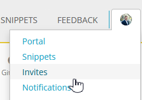
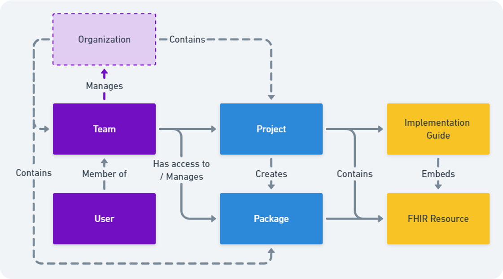
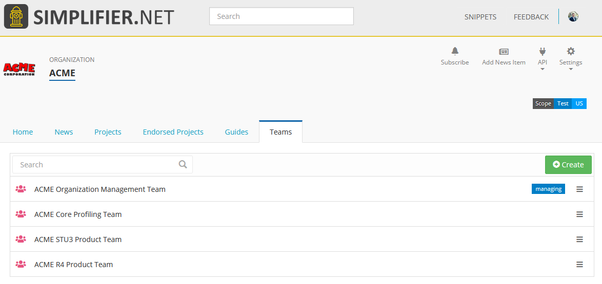
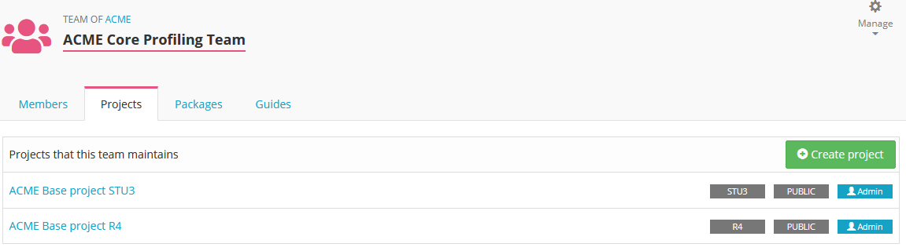
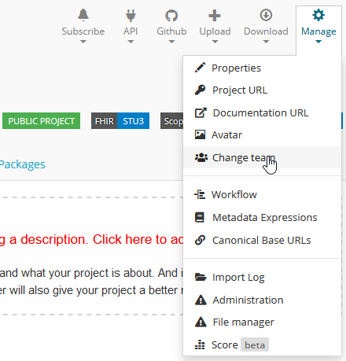

.. _Team_Management:
Team Management
^^^^^^^^^^^^^^^

.. important::

  `This feature is available from the Team plan and up <https://simplifier.net/pricing>`_

In your project, the license holder and Admin users can add more Team members. Under the ``Team`` tab you can add more Team members by inviting them by entering a valid emailaddress. 

.. image:: ./images/addTeamMembers.png



    
The invited Team member will receive an email informing them they have been invited to join a project. Under the ``Invites`` tab the user can accept the invite.


Team license
------------

When adding new team members to your project you have the option to assign "Admin", "Writer" or "Reader" rights to the users. You can change these rights at any time should someone's function change. In the table below the difference between these rights is explained. 

.. list-table:: Team member rights (Team license)
  :widths: 20, 10, 10, 10, 10
  :header-rows: 1

  * - Rights
    - View
    - Edit  
     
      resources
    - Team 
     
      management
    - Change Project 
     
      ownership

  * - Reader
    - ✔️
    - 
    - 
    - 


  * - Writer
    - ✔️
    - ✔️
    - 
    - 


  * - Admin
    - ✔️
    - ✔️
    - ✔️
    - 


  * - Project owner
    - ✔️
    - ✔️
    - ✔️
    - ✔️


Enterprise license
------------------

Enterprise licenses allow you to create an :ref:`Organization <Organization_page>`. Inside your Organization project teams can be managed the same as with the Team license. 



Additionaly, for Enterprise licenses the Team managament feature is available. You can acces this through the ``Teams`` tab in your Organization portal. 

Create Teams
````````````


In the Teams section Multiple teams can be created and managed. There are two types of teams available, the managing team and project teams. You can create multiple project teams, but only one managment team. The managing team members with Admin rights are given the same rights as the license owner. They will be allowed to create projects under the Organization and manage the Organizations project teams. One more benefit of adding people to the Managing team is that you can easily add them to other teams in the Organization. They are shown in the dropdown for adding members and don't even need to accept the invite anymore.

Team projects
`````````````



If you click on a create Team you will see the team portal. This gives an overview of the projects the Team is working on as well as the created packages and Implementation Guides. From this portal new projects can be created for that team to work on. 



In existing projects, the created project teams can be assigned as a whole to a project. Team assignment can be done in the project page. Navigate to ``Change team`` and in the next screen select the Team you want to have assinged to the project. 


